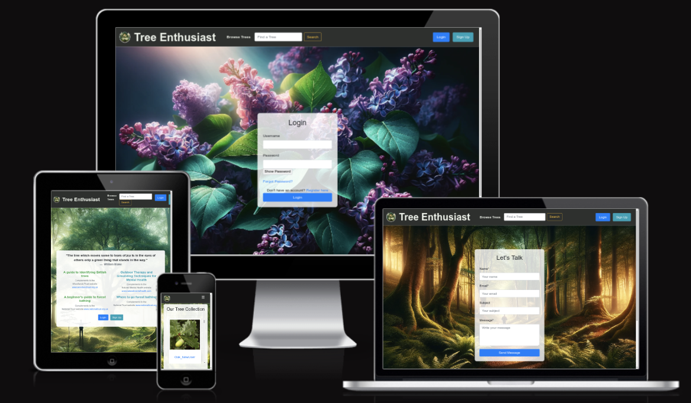

<h1>
    <a href="https://tree-enthusiast-vica781-11c9e6b9e6b1.herokuapp.com/">
        
    </a>
    TREE ENTHUSIAST
</h1>


[](https://tree-enthusiast-vica781-11c9e6b9e6b1.herokuapp.com/)

## Table of Contents

[Tree Enthusiast](#tree-enthusiast)
  * [Table of Contents](#table-of-contents)
  * [Introduction](#introduction)
  * [User Stories](#user-stories)
  * [UX](#ux)
    + [Typography](#typography)
    + [Wireframes](#wireframes)
  * [Accessibility](#accessibility)
  * [Database Design](#database-design)
  * [Features](#features)
  * [Existing Features](#existing-features)
  * [Future Features](#features-features)
  * [Issues and Bugs](#issues-and-bugs)
  * [Technologies Used](#technologies-used)
  * [Testing](#testing)
  * [Deployment](#deployment)
    + [Local Deployment](#local-deployment)
    + [Heroku Deployment](#heroku-deployment)
  * [Credits](#credits)
    + [Content](#content)
    + [Media](#media)
  * [Acknowledgements](#acknowledgements)

## Introduction
This website "Books for Life" is a fourth Portfolio Project of the Code Institute's Full Stack Web Development course. It is a Full Stack developed website. The website is built using Django 4.2.9, Bootstrap 4.6 and Python 3.11. The database is hosted on ElephantSQL and the static files are hosted on Cloudinary. The website is deployed on Heroku.
<br>


Embark on a botanical journey with the Tree Enthusiast App, a comprehensive tool designed for those who find joy and wonder in the embrace of nature's arboreal splendor. As William Blake poetically reflected, "The tree which moves some to tears of joy is in the eyes of others only a green thing that stands in the way." Our app aims to dissolve this barrier, revealing the true beauty of trees to every enthusiast.

#### Key Features:

***Discover and Browse:*** Explore a diverse collection of trees at your leisure. Our extensive database provides a wealth of information, allowing you to satisfy your arboreal curiosity.  
***Search for Specific Trees:*** Looking for information on a particular tree? Our robust search function makes it easy to find the details you need.  
***Printable Identification Guides:*** Take the knowledge with you on your adventures with handy guides that can be printed and brought along on your treks through nature.  
***Community Contributions:*** Registered users can become an integral part of our community by adding their tree discoveries to our collective repository, complete with their notes and insights.  
***Personal Collection Management:*** Curate your own personal collection of trees within the app. View, edit, and manage your contributions and see how they fit into the broader tapestry of communal knowledge.  
***Guided Forest Experiences:*** Connect deeper with nature through our guides on forest bathing and grounding techniques, bringing mental health and mindfulness to the forefront of your outdoor explorations.
<br>
The Tree Enthusiast App is not just a tool but a companion for your green escapades. It's a celebration of the trees around us, fostering a community that cherishes and preserves the natural world. Whether you are charting the woods for new specimens or simply enjoying the serenity of a forest bath, the Tree Enthusiast App enriches your experience and deepens your connection to the earth's towering guardians.
<br>
Join us and turn every green encounter into a moment of learning, sharing, and personal growth. With the Tree Enthusiast App, every tree is a story waiting to be told, and every forest a chapter yet to be explored.

## User Stories

1. As a ***new user***, I want to ***be able to register for an account on the "Books for Life" website***, so that I can ***log in with username or email, and password***.

2. As a ***registered user***, I want to ***be able to edit my profile information***, so I can ***easily change a password, and a profile picture***.

3. As a ***registered user***, I want ***the option to delete my user profile*** so I can ***decide to leave the website***.

4. As a ***registered user***, I want to ***add a new book to the website***, so that ***its details would be added to the database***.

5. As a ***registered user***, I want to ***be able to update the the books I've added***, so I can ***correct the information of the record (title, author, image, descriptions)***.

6. As a ***registered user***, I want to ***be able to delete book details from my profile***, so it ***will no longer be accessible***.

7. As a ***registered user***, I want to ***be able to like a book review*** so that I can ***keep track of my favorite books***.

8. As a ***registered user***, I want to ***see a list of all the books I've added to the website*** for ***easy reference***.

9. As a ***bibliophile*** and a ***registered user***, I want to ***access a dedicated "Favourites" page***, so I can ***see all the books I've liked in one place***.

10. As a ***bibliophile*** and a ***registered user***, I want to ***search for books on the website***, so that I can ***browse and discover new books added by all users on the website***.

11. As a ***registered user***, I want to ***be able to use a contact form***, so I can ***reach out to the website administrators with questions, feedback, or concerns***.

[Back to top ⇧](#table-of-contents)

## UX

### Development Planes

#### Strategy
- **Objective:** Create a user-centric site that encourages users to share and explore book recommendations, fostering a sense of community among book enthusiasts.
- **User Research:** Conduct surveys and user interviews to understand the needs, preferences, and pain points of both new and experienced book lovers.
- **Competitor Analysis:** Analyse similar platforms to identify gaps and opportunities in the market.
- **Persona Creation:** Develop user personas representing various types of users, including new users, registered users, and bibliophiles.
- **Goals:** Define measurable goals, such as increasing user engagement, time spent on the platform, and user-generated content.

##### Target Audience
**Roles:**
- New Users (unregistered)
- Registered Users
- Bibliophiles (Book Lovers)
- Administrators

**Demographics:**
- Desire to learn
- Desire to read more
- Book Lovers (Bibliophiles) 
- Self-learning individuals
- All ages

**Psychographics:**
- Personality & Attitudes:
- Curious
- Eager to learn
- Bibliophile

**Values:**
- Knowledge
- Self-improvement
- Community

**Lifestyles:**
- Interest in books
- Creative
- Knowledgeable

##### User and Client Needs
|User Needs|Client Needs|
|:---|:---|
|Register/Login to account|Provide a Book Database|
|Search for books|Log into administrator account for defensive design|
|View Book Details|Use website themselves|
|View Favourite Books||
|Get in Contact with Admin||

##### Importance/Viability Tables


[Back to top ⇧](#table-of-contents)

#### SCOPE
- **Features:** user registration, profile management, book addition, editing and deletion, liking books, viewing user-added books, a favourites page, contact form, and book search.
- **Content:** Book Review will contain book titles, authors, images, and descriptions (short and full).
- **User Flow:** The user will be able to register for an account, log in, add books, edit books, delete books, like books, view their books, view their favourites, and contact the admin.

- **Technical Requirements:** Front-End: HTML, CSS, Javascript, Bootstrap 5, Font Awesome; Back-End: Python, Django 4.1, PostgreSQL For deployment, the project will be hosted on Heroku, with static files stored on Cloudinary and the database hosted on ElephantSQL.The whole project will be version controlled using Git and GitHub.
Milestones: The whole project is broken down into smaller milestones, which are then broken down into tasks. The project will be managed using Github Project.The three milestones are: MVP Release, User Profile Issues, Project Refinement.

##### Content Requirements
- Content (text, images, videos) that user will need.
- The User will be looking for:
    - Customisable Account
    - Custom username/password
    - Add/Modify/Delete Book Details
    - View list of Favourite Books
- Easy and Intuitive Navigation
- Pleasant Theme (typography, imagery, colour palette)
- Book Detail Page:
    - Title
    - Author
    - Image URL
    - Description
    - Likes
- Searchable Book Database
- Contact Form
- Favourite Books Page
- User Added Books Page
- User Profile Page

##### Functionality Requirements
The user will be able to:
- Register for an account
- Log in to their account
- Log out of their account
- Add a book to the database:
    - Title
    - Author
    - Image URL
    - Short Description
    - Full Description
- Edit a book in the database
- Delete a book from the database
- Like a book
- View list of their favourite books
- View list of their added books
- View all books
- Search for books
- View book details
- Contact the admin
- View their profile
- Customise their profile
- Delete their profile
- View a custom 404 page

[Back to top ⇧](#table-of-contents)

#### STRUCTURE
- **Interaction Design:** The user will be able to interact with the website using a mouse and keyboard.
- **Information Architecture:** The information will be structured in a way that is easy to navigate and understand. The information will be organised into logical groups and categories, with the most important information being the most prominent.
- **Navigation:** The navigation will be intuitive and easy to use. The navigation will be consistent across the website, with the navigation bar being the primary means of navigation. The navigation will be responsive and will adapt to different screen sizes.
- **Information Design:** The information will be presented in a way that is easy to understand and digest. The information will be presented in a way that is visually appealing and engaging.
- **Interface Design:** The interface will be clean and simple. The interface will be responsive and will adapt to different screen sizes. The interface will be consistent across the website.

**Information Architecture and Navigation**
<!-- TODO: Make a Diagram -->
Unfortunately, there wasn't time to make the diagram that would reflect the final structure of the website. The diagram would be similar to the one below, but with updated pages and functionalities. That one is, unfortunatelly, done by hand and even more unfortunatelly, it's done by **my** hand.


[Back to top ⇧](#table-of-contents)
#### SKELETON
help me
- **Wireframes:** The wireframes were created using Balsamiq. The wireframes were created for desktop, tablet, and mobile devices. The wireframes were created for the following pages: Home, Register, Login, Profile, Add Book, Edit Book, Delete Book, Book Details, Favourites, User Added Books, Contact, and 404.

[Link to Wireframes](./docs/wireframes/initial_wireframes_balsamiq.pdf)

_N.B. The wireframes were created before the project was started. The final project will abundantly differ from the wireframes._

[Back to top ⇧](#table-of-contents)

#### SURFACE

##### Colour Scheme
[Sunny Bay Bridge color combination](https://www.canva.com/colors/color-palettes/sunny-bay-bridge/)


This colour scheme is used throughout the website. To it the standard Bootstrap colours are added. It is a nice and clean colour scheme that is easy on the eyes and doesn't disctract the user from the content.

##### Typography

Monserrat Alternates is used for the logo and headings. Roboto Serif is used for the body text. Mooli is used for the book titles. They are all [Google Fonts](https://fonts.google.com/).


##### Imagery
The images were created with DALL-E 2, a neural network that generates images from text descriptions. Other images were taken from unsplash. For details see [Credits](#credits).

##### Branding
A logo is created that reflect the essence of "Books for Life." Nothing fancy, just a simple logo that is easy to remember and recognisable (B4L). The tool used is the online [favicon.io](https://favicon.io/) generator.


##### Prototypes
Given the time constraints, the website was not prototyped. The website was built using the wireframes as a guide.

##### Feedback and Iteration
Generally, the developer relied on the feedback from the mentor and the peer-code review to improve the website. The developer also relied on the feedback from some other users to improve the website. The constant changing of the website functionalities and design was a result of the feedback received.

[Back to top ⇧](#table-of-contents)

## Accessibility
Website complies with accessibility standards. The Lighthouse Validation was used to check the website for accessibility issues. The website is fully accessible.

## Database Design
Database design was made with [QuickDBD](https://www.quickdatabasediagrams.com/). The database is hosted on ElephantSQL and is a PostgreSQL database.


- **UserProfile** Model extends the AbstractUser Model. The UserProfile Model is used to store additional information about the user, in this case a profile picture. It's activated once the user takes an action that requires a profile picture, that is updating the profile data.
- **Book** Model has fields _title, author, slug, short_description, full_description, image_url, likes,_ and _user_. The user field is a foreign key to the UserProfile Model. The likes in fact is not, stricly saying, the field of the book. It's Many to Many connection that generates a linking model between Book record and User record. The slug field is used to create a unique URL for each book. The slug field is automatically generated from the title and there's a custom save method that checks if the slug is unique. If it's not unique, a number is added to the slug. The slug field is used in the URL to identify the book. The id is used to identify the book in the database. The id is used in the URL to identify the book and it's generate automatically.
- **Category** model is a simple one. Other than id that is generated automatically, it has only a multiple choice field name. The name field is used to identify the category in the database. It is a One to Many relationship between Category and Book models. The original idea was to have Many to Many model, but there wasn't time for implementation.

[Back to top ⇧](#table-of-contents)


## Features

### Existing Features
#### Navbar
Navbar is based on a template from Bootstrap Documentation. On the left, there's a logo that is also a clickable link to the homepage. Find Book link to the page for searching books and the Contact Page link. THe Find Book link doesn't appear if the user is not logged in.
On the right, there are links to the Register and Login pages. If the user is logged in, the links to the Register and Login pages are replaced with the links to the Profile with a small profile image icon and Logout pages. Similarly, left of them, there are links Add Book, My Books and My Favourites that lead to the corresponding pages, and they also appear only on successfull login. The links are responsive and collapse into a hamburger menu on smaller screens.
For the profile image there's a default image that is used if the user doesn't upload their own image.

#### Footer
Footer is based on a template from [MdBootstrap Documentation](https://mdbootstrap.com/docs/standard/navigation/footer/). It contains links to the social media accounts of the website. The links open in a new tab. At the bottom, there are copywrite information. There's a JS code that takes care of the fotter's possibility to stick to the bottom of the page.

Navbar and Footer are the common elements for all the pages of the website.

#### Messages
In-built Django messages system is used to inform the user about the actions they took. The messages are displayed on the top of the page. The messages are responsive and disappear after a few seconds.

#### Homepage
On the homepage there are animations, images and a short description of the website. The animations are made with CSS and Javascript. The animations and contents are responsive. There are also buttons to My Books and My Profile Page.

#### Login/Register Pages
Login and Register Pages are simple pages with forms for login and registration. The forms are made with html and are controlled by views in Django. The forms are responsive. The forms are validated on the client side and the server side. The forms are validated on the client side with HTML5 validation. The final result is a new user record in the database. After the user is registered, the user is redirected to the My Books Page. After the user is logged in, the user is redirected to the My Books Page.

#### Contact Page
Contact Page is a simple page with a contact form. The form is made with EmailJS. The form is responsive. The form is validated on the client side and the server side. The form is validated on the client side with HTML5 validation. The final result is an email that the developer receives on their email account.

#### Find a Book Page
Find a Book Page is a page with a search form. The form is made with html and is controlled by a view in Django. The form is responsive. The form is validated on the client side and the server side. The form is validated on the client side with HTML5 validation. The final result is a list of books that match the search criteria.
There's a search field in which a user can write their queries. The button next to the search field triggers the search. The search works for the data that include titles, authors and categories of the books. If the input field is not empty, the clear search buttton appears. The clear search button clears the search field. If the input field is empty, the clear search button disappears. The search results are ordered by the date of creation of the book record.
The nuber of found records appears above the table. Table has as columns number (sequential), Author, TItle, Category, and like. On smaller screens, numbers and categories columns dissapear. The book can be liked or unliked by clicking on the heart icon. Unliked book has a blue shallow animated heart, liked the red solid animated heart. The implementation isn't perfect, because every (un)liking refreshes the page, and if there are many books, the pages moves to the top.
User can click on the title of the book to be redirected to the book details page.

#### Book Details Page
To this page the user is redirected when they click on the title of the book in the search results on Finda A Book Page, on My Books Page or on My Favourites Page. The page contains all the information about the book. The page is responsive. The page contains the title, author, image, full description, date of addition, category and the number of likes.
There's a Back button to bring the user back to the page from which they came to the Book Details. It is not he perfect solution, but it's the best that could be done in the time given.
There's also the possibility to like or unlike a book like on the Find a Book Page.
#### Add Book
Add Book Page is a page with a form for adding a book to the database. The form is made with html and is controlled by a view in Django. Only non required filed is the image. The form is validated on the client side and the server side. The final result is a new book record in the database. After the book is added, the user is redirected to the My Books Page.

#### My Books Page
My Books Page is a page with a table of books added by the user. The page is responsive. The table has as columns number (sequential), Author, Title, Category, and like. On smaller screens, numbers and categories columns dissapear. The book can be edited or deleted by clicking on the relative buttons on the right of the record. The user can click on the title of the book to be redirected to the book details page.
At the bootom of the page is Add a Book button that brings the user to the Add Book Page.
By clicking on the Edit button, the user is redirected to the Edit Book Page. By clicking on the Delete button, the user is redirected to the Delete Book Page.

#### Edit Book Page
Edit Book Page is a form for editing a book record. The form is made with html and is controlled by a view in Django. Only non required filed is the image. The form is validated on the client side and the server side.
The form is prepopulated with the data from the book record. The user can edit the data and submit the form. The final result is an updated book record in the database. After the book is edited, the user is redirected to the My Books Page.
If the user clicks on the Cancel button, they are redirected to the My Books Page without any changes in the record of the database.

#### Delete Book Page
Delete Book Page is a simple one. It contains the details of the book record: title, author, image, and short description.
There are also a confirmation message and two buttons. If the user clicks on the Delete button, the book record is deleted from the database and the user is redirected to the My Books Page. If the user clicks on the Cancel button, they are redirected to the My Books Page without any changes in the record of the database.
The original idea was to have a modal for the confirmation message on My Books Page, but there wasn't time for implementation.

### My Favourites Page
Similarly to Find a Book and My Books Pages, this Page contains a table of books. The table has as columns number (sequential), Author, Title, Category, and UnFav. On smaller screens, numbers and categories columns dissapear. The book can be unliked by clicking on the red X icon. By UnFav(ouring) of the book, the same is removed from the list.
At the bottom of the page is Add to Favourites button that brings the user to the Fidn a Book Page that allows users to like or unlike a book.

#### Profile Page
To arrive to Profile Page, user can click or on the button on the Homepage or on the link in the Navbar (that is, a round profile image with username on the right). The page contains the user's profile image, username and email. There are two buttons: Edit Profile and Delete Profile. By clicking on the Edit Profile button, the user is redirected to the Edit Profile Page.
By clicking on the Delete Profile button, the Delete Profile modal is called for the confirmation. If confirmed, the user is redirected to the Homepage and their profile is deleted from the database. The same deletion causes the deletion of all the books added by the user. The user is logged out and the session is terminated. If the user clicks on the Cancel button, they are back to the Profile Page without any changes in the record of the database.

#### Edit Profile Page
Edit Profile Page is a simple form that gives the user the possibility to change their email, pasword and profile image. The form is made with Django, and is controlled by a view in Django. The form is validated on the client side and the server side. The form is prepopulated with the data from the user record. The user can edit the data and submit the form. The final result is an updated user record in the database. After the user is edited, the user is redirected back to the Profile Page. If password is left empty, the password is not changed.
If the user clicks on the Cancel button, they are redirected to the Profile Page without any changes in the record of the database.
#### Custom Error Page
Custom 404 Error Page is made with Django. It is a simple page with a message and a large round image that changes from grayscale to colour on hoverm and by clicking on it, the user comes back to the Homepage.

#### Favicon
Favicons are made by the online [favicon.io](https://favicon.io/) generator. The favicon is a simple B4L logo that is self explanatory and recognizable.
#### Future Features
In early stages, the idea was to have a rich text editor for the book descriptions. The idea was to use Summernote. The implementation wasn't successful, and the idea was partialy abandoned. The idea is to implement it in the future.
The idea was to have a dedicated page for the categories in order to add a new category. The idea was to have a Many to Many relationship between the Book and Category models. The idea was to implement it in the future.
Another idea was to have a details of the contributing user on the book detail page, and to be able to see all the users and their books on the dedicated page. The idea was to implement it in the future. 
Obviously, there was the idea of implementing the administrator's access and different functionalities. Especially the control of the deletions (books and users) and the control of the categories. In that way, the deletion couldn't be automatic, but controlled by requests to Administrator.
Developer wanted to implement the pagination for all the tables, but there wasn't time for that. The idea is to implement it in the future.

[Back to top ⇧](#table-of-contents)

## Issues and Bugs
- *Book Deletion Modal*
    - **Issue:** The idea was to have a modal for the confirmation message on My Books Page, but there wasn't time for implementation. The attempt to add modal resulted in making automatic modal for the deletion for each record. That was not the desired result.
- *Book Liking*
    - **Issue:** The implementation isn't perfect, because every (un)liking refreshes the page, and if there are many books, the pages moves to the top. The developer tried to implement it without using JS, but that didn't give the desired result.
- *Back Button*
    - **Issue:** The idea was to have a Back button that would bring the user back to the page from which they came to the Book Details. It is not he perfect solution. It uses a navigation history to go one step back. If the book is (un)liked, and page refreshes, that back needs to be pressed a few times to get the user back to the desired page without refreshing the cache.
- *Book Short Description*
    - **Issue:** In early stages, the idea was to have a modal showing on book title clicked with only a short description and the button read more that would bring to the Book detail page. But, there wasn't time for full implementation.
- *Directory Structure*
    - **Issue:** The directory structure is not the best. The developer tried to make it as logical as possible, but there's a lot of room for improvement. The templates in the authors app are not following the ideal structure (/templates/app-name/...). Unfortunatelly, the developer realised that too late and didn't want to compromise the functionality of the website by changing the structure.

[Back to top ⇧](#table-of-contents)

## Technologies Used

### Main Languages Used
- [HTML5](https://en.wikipedia.org/wiki/HTML5)
    - The project uses **HTML5** to create the content of the website.
- [CSS3](https://en.wikipedia.org/wiki/CSS)
    - The project uses **CSS3** to style the content of the website.
- [JavaScript](https://en.wikipedia.org/wiki/JavaScript)
    - The project uses **JavaScript** to add interactivity to the website.
- [Python](https://en.wikipedia.org/wiki/Python_(programming_language))
    - The project uses **Python** to create the backend of the website.

### Frameworks, Libraries & Programs Used
#### Front-End
- [Bootstrap 5](https://getbootstrap.com/)
    - The project uses **Bootstrap 5** to simplify the structure of the website and make the website responsive easily.
- [Google Fonts](https://fonts.google.com/)
    - The project uses **Google Fonts** to style the fonts of the website. The fonts used are "Montserrat Alternates", "Roboto Serif", and "Mooli".
- [Font Awesome](https://fontawesome.com/)
    - The project uses **Font Awesome** to add icons to the website.

#### Back-End
- [Django](https://www.djangoproject.com/)
- The project uses **Django** to create the backend of the website.
- [pip3 (Python Package Installer)](https://pip.pypa.io/en/stable/) 
    - The project uses **pip3** to install the necessary tools and libraries.
- [PostgreSQL](https://www.postgresql.org/)
    - **PostgreSQL** to create the database of the website.
- [ElephantSQL](https://www.elephantsql.com/)
    - **ElephantSQL** for hosting of the database of the website.
- [Heroku](https://www.heroku.com/)
    - **Heroku** for the website deployment.
- [Cloudinary](https://cloudinary.com/)
    - The project uses **Cloudinary** to store the images of the website.
- [Summernote](https://summernote.org/)
    - The project uses **Summernote** to create a rich text editor for the website. Although, this functionality wasn't entirely implemented in the final version of the website.
- [gunicorn](https://pypi.org/project/gunicorn/)
    - The project uses Python **gunicorn** library to run the website on Heroku.
- [dj_database_url](https://pypi.org/project/dj-database-url/)
    - The project uses Python **dj_database_url** library to connect to the database on Heroku.
- [psycopg2](https://pypi.org/project/psycopg2/)
    - The project uses Python **psycopg2** library to connect to the database on Heroku.
- [python-dotenv](https://pypi.org/project/python-dotenv/)
    - The project uses **python-dotenv** library to hide sensitive information.

- [EmailJS](https://www.emailjs.com/)
    - EmailJS JavaScript library was used to create a functional contact form.

#### Other
- [Git](https://git-scm.com/) for version control.
- [GitHub](https://github.com/) for storing the repository online during development.
- GitHub Projects was used throughout the project for tracking of things to do and bug fixing - [the project's board here](https://github.com/users/tomdu3/projects/4).
- [Balsamiq](https://balsamiq.com/) to create the wireframes during the design process.
- [QuickDBD](https://www.quickdatabasediagrams.com/) to create the database design.
- [Am I Responsive](http://ami.responsivedesign.is/) to create the mockup image at the beginning of this file.
- [Lighthouse](https://developers.google.com/web/tools/lighthouse) to check the website for accessibility issues.
- [W3C Markup Validation Service](https://validator.w3.org/) to check the HTML code.
- [W3C CSS Validation Service](https://jigsaw.w3.org/css-validator/) to check the CSS code.
- [JSHint](https://jshint.com/) to check the JavaScript code.
- [CI Python Linter](https://pep8ci.herokuapp.com/) to check the Python code.
- [Favicon.io](https://favicon.io/) to create the favicon.
- [GitPod](https://gitpod.io/) as a cloud based IDE (only at the early stage of the development).
- [Visual Studio Code](https://code.visualstudio.com/) as a local IDE.
- [Chrome DevTools](https://developers.google.com/web/tools/chrome-devtools) for testing and debugging.
- [Google Chrome](https://www.google.com/chrome/) for testing and debugging.
- [Mozilla Firefox](https://www.mozilla.org/en-US/firefox/new/) for testing and debugging.
- [Microsoft Edge](https://www.microsoft.com/en-us/edge) for testing and debugging.
- [Canva Color Palette Generator](https://www.canva.com/colors/color-palette-generator/)
	- Canva Color Palette Generator was used to make the initial colour palette.
- [Webp Converter](https://developers.google.com/speed/webp)
	 - Webp Converter was used to convert images to WEBP format on Linux.
- [GIMP - GNU Image Manipulation Program](https://www.gimp.org/)
    - GIMP was used to resize and crop images.

- [Gnome-screenshot](https://help.gnome.org/users/gnome-screenshot/stable/)
    - Gnome-screenshot was used to take screenshots of the website.
- [Peek](https://github.com/phw/peek)
    - Peek was used to record the website in action.

[Back to top ⇧](#table-of-contents)

## Testing
For Testing details go to a separated file [TESTING.md](TESTING.md)


## Deployment
### Local Deployment

In order to make a local copy of this project, you can clone it. In your IDE Terminal, type the following command to clone the repository:

- `git clone https://github.com/tomdu3/books-for-life.git`

If done locally, the virtual environment needs to be created and activated. To do so, in your IDE Terminal, type the following commands:
```
python3 -m venv venv
```

If on Linux/MacOS, type the following command for activation:
```
source venv/bin/activate
```
On Windows type the following command for activation:
```
venv\Scripts\activate
```

Alternatively, if using Gitpod, you can click below to create your own workspace using this repository.

[](https://gitpod.io/#https://github.com/tomdu3/books-for-life)

***

After cloning or opening the repository in Gitpod, you will need to:

1. Create your own `.env` file in the root level of the project:

```
SECRET_KEY=[your_secret_key]
DEBUG=True
DATABASE_URL=postgres://[username]:[password]@[host]:[port]/[database_name]
CLOUDINARY_URL=cloudinary://[api_key]:[api_secret]@[cloud_name]
```
**Ensure the `.env` file is added to your `.gitignore` file so it doesn't get pushed to a public repository.

If you don't have a Cloudinary account already, you will need to [Sign Up for Free](https://cloudinary.com/users/register/free) to host the static files in the project.

2. Run `pip3 install -r requirements.txt` to install required Python packages.

3. Migrate the database models using:
`python3 manage.py migrate`

4. Create a superuser with your own credentials:
`python3 manage.py migrate`

5. Run the Django sever:
`python manage.py runserver`
The address of the server will appear in the terminal window.
Add /admin to the address to access the Django admin panel using your superuser credentials.

### Heroku Deployment

Sign up to [Heroku](https://heroku.com/) for free if you don't already have an account.

1. Create a new app in Heroku.

2. In the Resources tab of your app in the Heroku dashboard, click Add-Ons and select Heroku Postgres. Select Hobby Dev - Free as your plan.

3. When Heroku Postgres is installed, click the Settings tab in the Heroku Dashboard.
Click Reveal Config Vars, and add the same variables from your `.env` file here, except for `DEBUG`, as you don't want debug mode on the deployed project.

4. Copy the value of `DATABASE_URL` from the Config Vars. In your `settings.py` file, comment out the default database configuration, and add a new one with the Postgres url.

```
DATABASES = {
    'default': dj_database_url.parse('your DATABASE_URL here'),
}
```

5. Migrate the database models using:
`python3 manage.py migrate`

6. Create a superuser with your own credentials:
`python3 manage.py migrate`

7. Create a file called `Procfile` (no extension) containing the following:
```
web: gunicorn core.wsgi
```

8. Run `pip3 install -r requirements.txt` to install required Python packages.

9. Add the url of your Heroku app ('https://books-4-life-2d26bdf04dec.herokuapp.com/') to your `settings.py` file:

```
ALLOWED_HOSTS = [
    'books-4-life-2d26bdf04dec.herokuapp.com',...
]
```

10. Disable collect static so that Heroku doesn't try to collect static files when you deploy by adding the following to your Heroku Config Vars in the Settings tab of Heroku dashboard:

```
DISABLE_COLLECTSTATIC=1
```

The same variable has to be removed from Heroku Config Vars when you want to collect static files (for the testing and final deployment).

11. Stage and commit your files to GitHub
```
git add . 
git commit -m "Commit message"
git push
```

12. In the Heroku dashboard for your App, select Deploy.
Under Deployment Method, choose GitHub and search for your repository and click Connect.

13. Select Enable Automatic Deployments, and then Deploy Branch. Heroku will build the App from the branch you selected.

14. Now whenever you push your commits to GitHub, Heroku will rebuild the application.

### Forking the GitHub Repository
The project can be forked in order to make a copy of the original repository and propose changes to the project owner using Pull Requests.
That can be done by following these steps:
First, log in to GitHub and locate the [Project's Repository](github.com/tomdu3/books-for-life).
At the top of the Repository, on the right side of the page, locate the "Fork" button.
A copy of the Repository should now be in your GitHub account.
You can now propose changes to the Repository by creating a Pull Request.

### Live deployment
The web site is deployed on Heroku and can be found [here](https://books-4-life-2d26bdf04dec.herokuapp.com/).


[Back to top ⇧](#table-of-contents)

## Credits

### Code
- Navbar code was adapted from [Bootstrap](https://getbootstrap.com/docs/5.0/examples/navbars/).
- The code for the contact form was adapted from [EmailJS](https://www.emailjs.com/).
- The code for the custom 404 page was adapted from [Django Docs](https://docs.djangoproject.com/en/3.2/ref/views/#error-views).

- The code for the text animations on the Homepage:
    - Main title:
    "Flip Text Animation" adapted from [https://alvarotrigo.com/blog/css-text-animations/](https://alvarotrigo.com/blog/css-text-animations/)
    - Second title:
    [https://codepen.io/andysanchez-dev/pen/GYPevV*/](https://codepen.io/andysanchez-dev/pen/GYPevV*/)
- The code for the footer social media links was adapted from:
[https://mdbootstrap.com/docs/standard/navigation/footer/](https://mdbootstrap.com/docs/standard/navigation/footer/)

- The code for the Password Validators was adapted from:
[https://docs.djangoproject.com/en/4.2/ref/settings/#auth-password-validators](https://docs.djangoproject.com/en/4.2/ref/settings/#auth-password-validators) and
[https://code.djangoproject.com/ticket/28163](https://code.djangoproject.com/ticket/28163)

For the rest of the code, the developer relied on Code Institute's course material,
the [stackoverflow](https://stackoverflow.com/), [Django documentation](https://docs.djangoproject.com/en/3.2/), and John Elder's [Codemy](https://codemy.com/).

### Content
- The content of the website was written by the developer.

### Media
- The images used in the website were obtained from [Unsplash](https://unsplash.com/).
- The site logo was created using [favicon.io](https://favicon.io/).
- The mockup image at the beginning of this file was created using [Am I Responsive](http://ami.responsivedesign.is/).
- The Shakespeare image and the default book image of a monk were generated by [DALL-E 2](https://openai.com/dall-e-2).

### Acknowledgements
- Seun Owonikoko, my mentor, for her guidance and support. Without her, this project wouldn't be possible or remotely as interesting.
- Rebecca Tracey-Timoney, our cohort lead, for her wise guidance and all the material she shared with me. All similarities between this project and her material are _**not coincidental**_.
- Code Institute's Slack community for their support and feedback.
- Code Institute's Tutor Support for their support and feedback (I don't want to give names. I hope that's ok with you, Rebecca :-)).
- My dear colleagues and friends from the Code Institute's Full Stack Web Development, especially Sirinya, Victoria, Richard, Lauren, Ho, for their support and testing services.
- My friends: Boris, Zeljka and Dragan for helping me with the testing.