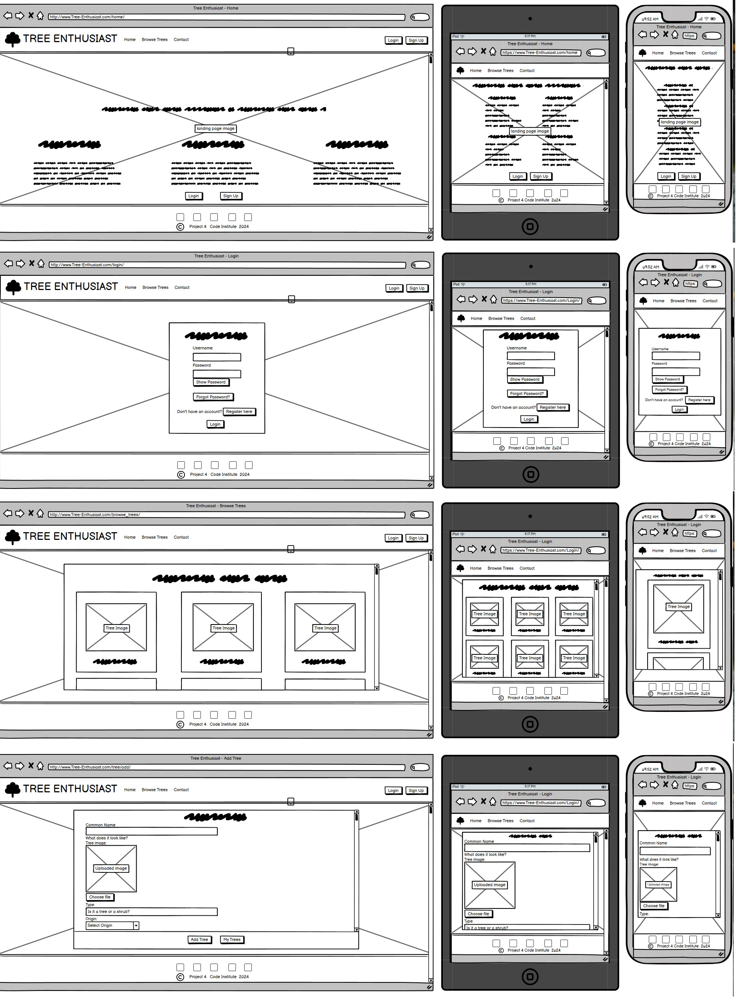

<h1>
    <a href="https://tree-enthusiast-vica781-11c9e6b9e6b1.herokuapp.com/">
        
    </a>
    TREE ENTHUSIAST
</h1>


[](https://tree-enthusiast-vica781-11c9e6b9e6b1.herokuapp.com/)

## Table of Contents

[Tree Enthusiast](#tree-enthusiast)
  * [Table of Contents](#table-of-contents)
  * [Introduction](#introduction)
  * [User Stories](#user-stories)
  * [UX](#ux)
    + [Typography](#typography)
    + [Wireframes](#wireframes)
  * [Accessibility](#accessibility)
  * [Database Design](#database-design)
  * [Features](#features)
  * [Existing Features](#existing-features)
  * [Future Features](#features-features)
  * [Issues and Bugs](#issues-and-bugs)
  * [Technologies Used](#technologies-used)
  * [Testing](#testing)
  * [Deployment](#deployment)
    + [Local Deployment](#local-deployment)
    + [Heroku Deployment](#heroku-deployment)
  * [Credits](#credits)        
  * [Acknowledgements](#acknowledgements)

## Introduction
This website "Books for Life" is a fourth Portfolio Project of the Code Institute's Full Stack Web Development course. It is a Full Stack developed website. The website is built using Django 4.2.9, Bootstrap 4.6 and Python 3.11. The database is hosted on ElephantSQL and the static files are hosted on Cloudinary. The website is deployed on Heroku.

Embark on a botanical journey with the Tree Enthusiast App, a tool designed for those who find joy and wonder in the embrace of nature's arboreal splendor. As William Blake poetically reflected, "The tree which moves some to tears of joy is in the eyes of others only a green thing that stands in the way." This app aims to dissolve this barrier, revealing the true beauty of trees to every enthusiast.

### Key Features:

***Discover and Browse:*** Explore a diverse collection of trees at your leisure. The extensive database provides a wealth of information, allowing you to satisfy your arboreal curiosity.  
***Search for Specific Trees:*** Looking for information on a particular tree? App's search function makes it easy to find the details you need.  
***Printable Identification Guides:*** Take the knowledge with you on your adventures with handy guides that can be printed and brought along on your treks through nature.  
***Community Contributions:*** Registered users can become an integral part of our community by adding their tree discoveries to the app's collective repository, complete with their notes and insights.  
***Personal Collection Management:*** Curate your own personal collection of trees within the app. View, edit, and manage your contributions and see how they fit into the broader tapestry of communal knowledge.  
***Guided Forest Experiences:*** Connect deeper with nature through our guides on forest bathing and grounding techniques, bringing mental health and mindfulness to the forefront of your outdoor explorations.
<br>
<br>
The Tree Enthusiast App is not just a tool but a companion for your green escapades. It's a celebration of the trees around us, fostering a community that cherishes and preserves the natural world. Whether you are charting the woods for new specimens or simply enjoying the serenity of a forest bath, the Tree Enthusiast App enriches your experience and deepens your connection to the earth's towering guardians.
<br>
<br>
Join the comunity and turn every green encounter into a moment of learning, sharing, and personal growth. With the Tree Enthusiast App, every tree is a story waiting to be told, and every forest a chapter yet to be explored.

[Back to top ⇧](#table-of-contents)

## User Stories

For a detailed view of the planned features and their development status, visit the project's agile board:

[Tree Enthusiast Agile Board](https://github.com/users/vica781/projects/3)

1. As a ***new user***, I want to ***be able to register on the platform***, so that I can ***login and get access***.

2. As a ***user***, I want to ***log in to my account***, so that I can ***access personalized features and secure my account information***.

3. As a ***user***, I want to ***be able to securely log out of my account***, so that I can ***ensure my account is safe when I'm not using it.***

4. As a ***user/tree enthusiast***, I want to ***easily access and use the contact page on the website***, so that I can ***reach out for support or share feedback about my experiences with adding and viewing tree information.***

5. As a ***registered user***, I want to ***easily manage my account and personalize my profile***, so that I can ***enhance my user experience and maintain my account security.***

6. As a ***registered user***, I want to ***delete my profile securely and with clear confirmation steps***, so that I can ***ensure that my decision is intentional and informed, and be reassured of successful deletion.***

7. As a ***registered and logged-in user***, I want to ***add a new tree to my collection***, so that I can ***share information about different trees.***

8. As a ***registered and logged-in user***, I want to ***add a new tree to my collection***, so that I can ***share information about different trees.***

9. As a ***registered and logged-in user***, I want to ***edit the information of trees I have added***, so that I can ***update or correct their details as needed.***

10. As a ***registered and logged-in user***, I want to ***have the ability to delete trees from my collection***, so that I can ***remove outdated or incorrect tree entries.***

11. As a ***user of the Tree Enthusiast website***, I want to ***search for trees using their common names***, so that I can ***quickly find specific trees and learn more about them.***

12. As a ***visitor to the Tree Enthusiast website***, I want to ***access a 'Browse Trees' feature***, so that I can ***view all trees listed in the database in a user-friendly format***, and if interested, be prompted to 'Login' or 'Sign Up' for further interactions. As a ***registered and logged-in user***, I should be able to ***edit or delete trees I have added***, or access 'Add Tree', 'My Trees', or 'Home' when viewing tree details.

13. As a ***registered and logged-in user*** of the Tree Enthusiast website, I want to ***search and view trees with a specific common name added by any user***, while being able to ***edit and delete only the trees that I have added***, and have access to 'My Trees', 'Add Tree', and 'Home' buttons when viewing trees added by others, so that I can ***manage my contributions and navigate the site effectively without affecting other users' entries.***

[Back to top ⇧](#table-of-contents)

## UX

### Refined Development Plan for Tree Enthusiast App

#### Strategy
- **Objective:** Craft a multi-faceted platform that serves as a hub for tree identification, educational growth, and mental wellness through nature, catering to the needs of a diverse community of tree enthusiasts and those seeking solace in nature.
- **User Research:** Expand surveys and user interviews to encompass individuals seeking outdoor-related mental wellness in addition to tree identification knowledge.
- **Competitor Analysis:** Examine other platforms that provide not just botanical information but also those that delve into the therapeutic aspects of nature.
- **Persona Creation:** Include personas such as nature therapy seekers, educators in botany and mental health professionals who recommend nature as therapy.
- **Goals:** Enrich goals to include the broadening of the app's resource base, fostering collaboration with mental health and environmental organizations, and creating a comprehensive guide to forest therapy techniques.

[Back to top ⇧](#table-of-contents)

### Target Audience

#### Roles:
- Beginners in Tree Identification
- Nature Therapy Participants
- Environmental Educators and Mental Health Professionals
- App Administrators, Content Creators, and Moderators

#### Demographics:
- Broad spectrum, from school-age children to seniors
- Individuals seeking therapeutic experiences through nature
- Professionals and volunteers in environmental and mental health sectors

### Psychographics:

#### Personality & Attitudes:
- Inquisitive about nature's diversity
- Advocates for mental health and well-being
- Believers in ecotherapy and the healing power of nature

### Values:
- Nature conservation and biodiversity
- Mental wellness and holistic health
- Education and the sharing of expertise

### Lifestyles:
- Outdoor enthusiasts and hikers
- Individuals practicing mindfulness and relaxation techniques
- Educators and therapists incorporating nature into their practice

[Back to top ⇧](#table-of-contents)

### User and Client Needs

***

| User Needs                         | Client Needs                 |
|------------------------------------|------------------------------|
| Register/Login to account          | Manage User Accounts         |
| Search for trees                   | Provide a Tree Database      |
| View Tree Details                  | Ensure Data Accuracy         |
| Add/Edit Own Tree Entries          | Accessible Tree Editing Tool |
| View Personal Tree Collection      | User Activity Insights       |
| Get in Contact with Admin          | Customer Support Management  |
| Share Tree Information             | Social Media Integration     |
| Accessible Navigation              | User Engagement              |

### Importance/Viability Tables

***

##### User Management Table
| Feature             | Importance | Viability | Notes                                       |
|---------------------|------------|-----------|---------------------------------------------|
| Register            | 5          | 5         | Allows users to create a new account.       |
| Log In              | 5          | 5         | Allows users to access their accounts.      |
| Log Out             | 5          | 5         | Allows users to securely exit their accounts. |
| Edit Profile        | 4          | 4         | Registered users can update personal information. |
| View User Profile   | 4          | 5         | Users can view their own and others' profiles. |
| Delete Profile      | 3          | 4         | Allows users to remove their account from the app. |

##### Tree Management Table
| Feature              | Importance | Viability | Notes                                       |
|----------------------|------------|-----------|---------------------------------------------|
| Add Tree Details     | 5          | 5         | Registered users can add new tree entries.  |
| Edit Tree Details    | 4          | 5         | Users can edit trees they've added.         |
| Delete Tree Record   | 4          | 4         | Users can delete trees they've added.       |
| Search Tree Records  | 5          | 5         | All visitors can search the tree database.  |
| Browse Tree Records  | 5          | 5         | All visitors can browse the tree collection.|
| View Individual Tree Details | 5  | 5         | All visitors can view tree details.         |
| Like/Dislike Tree    | 4          | 3         | Registered users can like or dislike trees. |
| Comment on Tree      | 4          | 3         | Registered users can comment on tree details.|

##### Other Features Table
| Feature                 | Importance | Viability | Notes                                    |
|-------------------------|------------|-----------|------------------------------------------|
| Welcoming Page          | 5          | 5         | First page visitors see, unregistered and registered. |
| Contact Page            | 3          | 5         | Allows users to contact admins.          |
| Social Media Integration| 3          | 4         | Lets users share trees on social media.  |

[Back to top ⇧](#table-of-contents)

## SCOPE

### Features:
- User registration
- Profile management
- Tree collection browsing
- Individual tree detail viewing
- Tree addition, editing, and deletion
- Comment functionality
- Like/dislike functionality
- Personal tree collection access
- Contact form
- Tree search

### Content:
- Tree Enthusiast will contain:
  - Tree names
  - Types
  - Origins
  - Images
  - Descriptions
  - Habitat information
  - User contributions

### User Flow:
- Unregistered visitors can:
  - Browse and search the tree collection
  - View tree details
- Registered users can:
  - Log in
  - Add trees to the collection
  - Manage their personal tree collection
  - Edit and delete tree information they have added
  - Utilize like/dislike and comment functionalities on tree details

[Back to top ⇧](#table-of-contents)

### Technical Requirements:
- **Front-End:**
  - HTML
  - CSS
  - JavaScript
  - Bootstrap 4.6
  - Font Awesome
- **Back-End:**
  - Python
  - Django 4.x
  - PostgreSQL
- **Deployment:**
  - Hosted on a platform like Heroku
  - Static and media files stored on Cloudinary
  - Database hosted on ElephantSQL
- **Version Control:**
  - Git
  - GitHub

### Milestones:
- Divided into phases:
  - Initial release
  - Feature additions
  - Final refinements
- Managed using Github Projects

[Back to top ⇧](#table-of-contents)

## Content Requirements

- Customisable user accounts with the ability to add, modify, and delete tree details.
- Intuitive navigation with a user-friendly theme (typography, imagery, color palette).
- **Tree Detail Page to include:**
  - Common Name
  - Tree Type
  - Origin
  - Image
  - Description
  - Habitat Information
  - Likes/Dislikes
  - Comments
- Searchable tree database
- Contact form for user inquiries
- Personal tree collection page for users to manage their added trees
- User profile page to view and edit profile details

[Back to top ⇧](#table-of-contents)

## Functionality Requirements

- Users will be able to:
  - Register and create a personalized account
  - Log in to and out of their account
  - Browse the entire tree collection without registration
  - Search for trees within the database
  - View detailed information about each tree
  - Add new trees to the database with details such as name, type, image, description, and habitat information
  - Edit and delete their own tree entries
  - Like/dislike trees and view the total number of likes/dislikes
  - Comment on tree details for interaction with other users
  - Access and manage their personal collection of added trees
  - Contact the admin through a form for support or inquiries
  - Customize their user profile, including uploading a profile picture and editing profile details
  - Delete their user profile
  - Encounter a custom 404 page when attempting to visit a nonexistent page

[Back to top ⇧](#table-of-contents)

## STRUCTURE

### Interaction Design:
- Users will interact with the Tree Enthusiast app through a combination of mouse clicks and keyboard inputs.
- Touchscreen-friendly features for mobile and tablet users.
- Interactive elements such as buttons, forms, and search field will provide visual feedback to facilitate user interaction.

### Information Architecture:
- Information will be hierarchically structured, emphasizing ease of access to key features like tree browsing, searching, and user profile management.
- Key information such as tree details will be prominently displayed.

### Navigation:
- Navigation will be straightforward and user-friendly, with a consistent and prominently placed navigation bar across the website.
- A responsive design to ensure seamless navigation on various devices, including desktops, tablets, and smartphones.
- Access to main features like 'Browse Trees', 'My Trees', and 'Add Tree' will be available from the main menu, with additional options accessible from related screens/forms.

### Information Design:
- Information will be presented in a clear, concise, and engaging manner.
- Information such as tree descriptions and habitat details will be organized into readable segments for ease of understanding.

### Interface Design:
- A clean and minimalist interface that highlights the app's features without overwhelming the user.
- Responsive design principles to ensure the interface is optimized for a variety of screen sizes and resolutions.
- Consistency in design elements such as color schemes, typography, and button styles across different pages for a cohesive user experience.

[Back to top ⇧](#table-of-contents)

### **Information Architecture and Navigation:**

The information architecture and navigation diagram for the Tree Enthusiast web application, depicted in the attachment, was crafted using the [Lucid app](https://www.lucidchart.com). The diagram serves as a testament to the CRUD (Create, Read, Update, Delete) functionality embedded within the application's framework.

Starting at the homepage, users are greeted with the option to delve into guided forest experiences. A decision node promptly distinguishes the pathways for visitors, who can choose to sign up or log in, and registered users, who have the facility to directly log into their accounts. The user profile is strategically placed as a central node that branches out into three distinct actions embodying the CRUD principles: viewing (Read), editing (Update), and deleting (Delete) their profile, which is indicative of the personalized experience the application offers.

The trees collection forms the heart of the Tree Enthusiast, showcasing an interactive array where visitors can browse (Read) and search for trees. Here, registered users are granted the capabilities to expand the collection by adding (Create) new trees, as well as curating their personal 'My Trees' collection through edit (Update) and delete (Delete) functions. This not only highlights the CRUD operations but also underscores user engagement and content management within the application.

Further enhancing the user interface, a contact route anchors the flowchart, extending users the courtesy to connect with the site administration or engage via social media, fostering a community-centric environment.

This meticulously constructed flowchart delineates the user journey within the Tree Enthusiast app, seamlessly integrating CRUD operations for an optimized user experience. It underscores the ease of navigation and intuitive interaction with the app's features, thereby ensuring a user-centric digital environment. 

For more details on the technologies used in the development of the Tree Enthusiast application, please refer to the [Technologies Used](#technologies-used) section or return to the [Table of Contents](#table-of-contents).


[Back to top ⇧](#table-of-contents)

#### SKELETON
##### **Wireframes**

The wireframes were created using Balsamiq. The wireframes were created for desktop, tablet, and mobile devices. 

[Link to Wireframes](./media/docs_images/wireframes.png)



_N.B. The wireframes were created before the project was started. The final project will abundantly differ from the wireframes._

[Back to top ⇧](#table-of-contents)

#### **SURFACE**

##### Imagery and Colour Scheme

The selection of images for the Tree Enthusiast app is a meticulous process that seeks to reinforce the application’s purpose of connecting nature lovers and providing a tranquil user experience. Each image is deliberately chosen for its visual appeal and its ability to evoke a sense of calm and serenity, mirroring the tranquility one might find in a forest. The images were created with DALL-E 3, a neural network that generates images from text descriptions.

 

[Back to top ⇧](#table-of-contents)

The overarching green palette, highlighted by the lush forest backgrounds, sets a thematic continuity that aligns with the app’s core subject—trees. This choice of imagery not only brings users closer to the subject matter but also serves as a constant visual reinforcement of the app’s theme. The incorporation of detailed macro photography, such as close-ups of sea buckthorn and vibrant foliage, further immerses users in the natural world, fostering a deeper connection with the content.


The overlay colors on different screens and image cards are carefully chosen to not overpower the underlying images, ensuring that the content remains the focal point. These overlays utilize a subtle opacity that allows for legibility of text while maintaining the integrity of the images behind them. This delicate balance between visibility and aesthetics enhances user engagement without distracting from the app’s verdant imagery.


[Back to top ⇧](#table-of-contents)

In addition, the color of the font used in the navigation bar and the footer is optimized for readability against the variable backgrounds. The choice of a light-colored font on a darker background ensures legibility across diverse images, whether the backdrop is the dense green of a forest or the vivid oranges of sea buckthorn berries. This consistent color scheme across the app’s interface elements ensures a harmonious visual experience for users, regardless of the content they are viewing. To analise the colour palette developer used tools from [ColorSpace](https://mycolor.space/?hex=%23EFF4EB&sub=1).


Favicons and profile images featuring silhouettes of trees and leaves reinforce the botanical focus of the app. They serve as a visual shorthand for the app’s purpose, providing a consistent and recognizable branding across various user interfaces.


Overall, the design choices made in the Tree Enthusiast app are reflective of an intentional strategy to harmonize the visual elements with the user interface. By employing a consistent and nature-inspired color scheme, the app creates an immersive experience that is both visually cohesive and user-friendly. The seamless integration of imagery and interface elements contributes to a user experience that is both aesthetically pleasing and functionally intuitive, allowing users to navigate the app with ease while remaining engaged with its content.

[Back to top ⇧](#table-of-contents)

##### Typography

For the Tree Enthusiast application, we've embraced a typography approach that ensures clarity, accessibility, and optimal text rendering across various devices and operating systems. Instead of selecting custom typefaces, we've utilized the native font stack available in [Bootstrap 4.6](https://getbootstrap.com/docs/4.6/content/reboot/), which adapts to the default system font of our users' operating systems. This not only provides a seamless user experience but also leverages the high-performance type rendering that users are accustomed to on their devices.


- For macOS and iOS devices, the UI will display in **San Francisco**, providing a crisp and adaptable interface that aligns with Apple's design aesthetics.
- **Segoe UI** will be used on Windows systems, which integrates smoothly with Microsoft's modern UI.
- Android devices will render the app in **Roboto**, Google's signature font that's been designed for legibility on digital screens.
- On Linux systems, **Noto Sans** offers a uniform appearance, supporting a wide range of scripts for international users.
- Fallback fonts, such as **Helvetica Neue**, **Arial**, and **sans-serif**, ensure that if the primary fonts are not available, the text still appears polished and readable.

Using the native font stack not only provides a comfortable and familiar reading experience but also aligns with our app's theme of natural elegance and simplicity. Our choice reflects our commitment to performance, sustainability, and user-centric design principles.

For more information on native font stacks and their benefits, please refer to this insightful [article by Smashing Magazine](https://www.smashingmagazine.com/2015/11/using-system-ui-fonts-practical-guide/).

##### Prototypes

For the development of the Tree Enthusiast app, a fully interactive prototype was not created due to the iterative nature of the development process. The application was built iteratively, with features being added and refined as needed. The initial wireframes served as a foundational guide, but the design evolved organically as the project progressed.

##### Feedback and Iteration

The development of Tree Enthusiast has been greatly informed by feedback from various sources. The guiding insights from a dedicated mentor provided the initial direction, while peer reviews contributed to refinements along the way. User feedback was invaluable, highlighting usability and design improvements that were iteratively integrated. This ongoing feedback loop has been crucial in shaping an app that meets the needs of tree enthusiasts while remaining agile and responsive to change. Each iteration has brought functional enhancements and design polish, ensuring that the app not only functions well but also provides a visually pleasing and intuitive user experience.

[Back to top ⇧](#table-of-contents)

## Accessibility

Ensuring website is accessible to all users is a core principle of the Tree Enthusiast app development. Developer have strived to meet accessibility standards to provide a user-friendly experience that is inclusive for individuals with disabilities.

To assess and enhance website's accessibility, developer utilized Lighthouse, an open-source, automated tool by Google that improves the quality of web pages. Lighthouse was instrumental in checking site's for accessibility issues.

The Tree Enthusiast app has been meticulously tested with Lighthouse Validation to ensure that it adheres to the best practices of web accessibility. As a result of commitment and continuous testing, the website currently holds a high accessibility score, reflecting its full accessibility for all users.

Developer is committed to maintaining and improving the accessibility of the Tree Enthusiast app as web standards evolve and as user feedback received. Developer's goal is to ensure that every user, regardless of their ability, can explore, share, and contribute to vast tree database effortlessly.

[Back to top ⇧](#table-of-contents)

## Database Design
Database design was made with [QuickDBD](https://www.quickdatabasediagrams.com/). The database is hosted on ElephantSQL and is a PostgreSQL database.


The database for the Tree Enthusiast app is designed to store user profiles, tree information, and contact messages. It utilizes the PostgreSQL database and the models are structured as follows:

- **Profile Model**: This model extends the built-in Django User model to store profile images using Cloudinary's cloud-based image management solution. It's linked to the User model with a one-to-one relationship, ensuring that each user has a single corresponding profile. The profile is automatically created or updated when a user registers or modifies their profile information.

- **Tree Model**: This model captures the details of individual trees. It includes fields for common names, tree types, origins, introductions, images, and habitats. Each tree is associated with a user through a foreign key relationship, allowing for easy tracking of which user added the tree. Timestamps for creation and updates are automatically managed by Django.

- **Message Model**: Designed to store contact form submissions, this model includes fields for the sender's name, email, optional subject, and the message body. Each message is timestamped upon creation to keep a record of when it was sent.

To visualize the relationships and structure, diagrams can be created using tools like [QuickDBD](https://www.quickdatabasediagrams.com/). The models are organized to facilitate the app's functionality in allowing users to manage their tree collection and communicate through the contact form.

[Back to top ⇧](#table-of-contents)

## Features

### Existing Features

#### Navbar
- The logo functions as a link to the homepage, ensuring users can always navigate back easily.
- Features a user-specific navigation experience; authenticated users can access options to add trees and manage their collections.
- Search functionality embedded in the navbar allows users to find specific trees.
- Adapts to different devices with a collapsible hamburger menu on smaller screens.

#### Footer
- Styled with Bootstrap for consistency and contains important links, including social media and contact information.
- Social media links open in new tabs to maintain user presence on the app.

#### User Authentication System
- Secure registration, login, and logout capabilities.
- Users can manage their profiles, with the option to update personal information or delete their account.
- Profile management includes a default profile image which can be replaced with a user-uploaded one.
- Show/Hide password functionality improves the user experience on authentication forms.

#### Home Page Features for Visitors and Users
- The **Home page** serves as an **inspirational gateway** into the app, highlighting the app's central theme of tree appreciation with a visually engaging design.
- **Visitors** are treated to **educational resources**, an **inspirational quote** related to the beauty of trees, and **links to guides** on tree identification and forest therapy.
- The page encourages exploration with quick access to resources about the benefits of forest bathing and outdoor therapy for mental health, complementing the information with links to authoritative external content.
- **Call-to-action buttons** prompt visitors to register or log in, offering a clear path to a more personalized experience, such as adding new trees or viewing their tree collection.
- **Registered users** receive a warm welcome by name and can navigate easily with tailored options like 'Add Tree' and 'My Trees', designed to enhance their interactive experience with the app.

#### Tree Management Features
- Users can add new tree entries with a form that accepts detailed information.
- Edit and delete capabilities allow users to manage their tree collection effectively.
- Individual tree detail pages offer comprehensive information and imagery.

#### Browsing Trees
- Visitors to the site can browse the tree collection without the need to register or log in, encouraging engagement with the app's content right from the start.
- Each tree is presented in a card layout with a clear image and the common name displayed, making it easy for users to visually scan and select trees of interest.
- Registered users have the added functionality of adding trees to their personal collection directly from the browse view, promoting interaction and personalized curation of content.
- The browsing page includes a infinite scroll to ensure a seamless browsing experience, even with a large number of entries.
- For both visitors and registered users, clicking on a tree card directs to a detailed view, offering a deeper dive into the information about the tree species, including its habitat, origin, and other engaging details.
- The browsing feature is fully responsive, ensuring that visitors and users have a consistent experience across all devices, whether they are at home on a desktop computer or on-the-go with a mobile device.

#### Search Functionality
- Allows for keyword searches throughout the tree database, displaying results in a visually pleasing card layout.

### Custom Error Pages
To enhance the user experience, our app includes customized error pages that guide users back to the app's main content when they encounter an error.

#### 404 Page Not Found
Our custom 404 page gently informs users that the page they are looking for cannot be found. It provides a clear and friendly message, assuring them that it's just a minor detour. The page features a serene forest background and offers a direct link to return to the homepage.


#### 405 Method Not Allowed
When a user attempts an action that's not allowed, our 405 error page is there to guide them. It acknowledges the wrong turn with a calm forest backdrop and encourages users to return to the main path, offering a link back to the safety of the homepage.

#### 500 Internal Server Error
Unexpected server issues are addressed with our 500 error page. It reassures users that we are aware of the problem and are diligently working to fix it. While our digital environment recovers, users can click on the provided link to return to the homepage, which remains a bastion of tranquility and order amidst the chaos.


Each error page maintains the app's theme, reflecting the natural and peaceful essence of our brand while providing users with a seamless and non-disruptive experience during their digital nature walks.

#### Responsive Layout
- Ensures a fluid experience on a variety of devices, with pages and components that adjust to screen sizes.

#### Additional UI Features
- Password visibility toggle for ease during authentication processes.
- Modal dialogs for critical actions:
  - Confirmations for logging out, deleting user profiles, and removing tree entries ensure intentional user interactions and prevent accidental data loss.
  - Modal forms for user and tree deletions include password confirmation to secure the process.

[Back to top ⇧](#table-of-contents)

## Features Left to Implement

Providing users with opportunity like and dislike posts about Trees, and comment on them was one of the planned User Stories, these features were not implemented due to time constraints. These features are still under consideration for future development. For a detailed view of the planned features and their development status, visit the project's agile board:

[Tree Enthusiast Agile Board](https://github.com/users/vica781/projects/3)

### User Interaction with Tree Content
While the Tree Enthusiast website has a multitude of features, there are always more ways to engage users. A key feature set that was earmarked for future implementation is the ability for visitors and registered users to like or dislike trees, along with the capability to see the like/dislike counts and comment on the detailed tree view pages.

#### Interaction Icons and Counts
- **Like and Dislike Icons**: Visitors should be able to see like and dislike icons with counters on the tree overview cards and detailed pages.
- **User Engagement**: Enable registered and logged-in users to like or dislike trees and comment on them directly from both the overview listings and detailed pages.

#### Dynamic Content Updates
- **Real-time Updates**: Interaction counts and comments should update dynamically to reflect real-time user engagement.
- **Prompt for Action**: Encourage non-logged-in visitors to register or log in when they attempt to interact with tree content.

#### User-Friendly Interface
- **Consistency Across Views**: The like, dislike, and comment features should be presented in a user-friendly and consistent manner throughout the site.
- **Performance Considerations**: Ensure the new interactive features do not impact the site's performance negatively, maintaining a smooth user experience.

The implementation of these features will further the goal of creating an engaging and community-driven website where tree enthusiasts can share and express their opinions and knowledge about different tree species.

[Back to top ⇧](#table-of-contents)

## Features for Future Development

As the Tree Enthusiast app evolves, several key features are envisioned for future development. These enhancements aim to elevate the user experience, broaden engagement, and deepen the app's utility as a comprehensive resource for tree enthusiasts and nature lovers.

### Interactive Tree Map
- **Global Tree Mapping:** Implement a feature that allows users to pin locations on an interactive map where specific trees can be found. This would create a visually engaging and informative global tree map.
- **User Contributions:** Enable users to contribute to the map by adding their own tree discoveries, along with photos and notes.

### Mobile App Development
- **Cross-Platform App:** Develop a mobile application for iOS and Android to provide users with on-the-go access to the Tree Enthusiast's resources.
- **Offline Accessibility:** Include offline capabilities for key features like the tree database and identification guides, useful for users in areas with limited internet access.

### Advanced Tree Identification Tool
- **AI-Driven Identification:** Integrate an AI-based tool that can identify tree species from user-uploaded photos, simplifying the process of discovering and learning about different trees.

### Community and Social Features
- **User Forums:** Establish forums or discussion boards for users to share experiences, advice, and stories about their tree-related adventures and discoveries.
- **Event Calendar:** Introduce a feature for sharing and promoting tree-related events, such as local tree-planting initiatives, guided nature walks, or educational workshops.

[Back to top ⇧](#table-of-contents)

## Issues and Bugs

During the development and testing phases of the Tree Enthusiast app, various challenges were encountered and addressed. However, one persistent issue that remains pertains to the responsiveness of the app, specifically when viewed on ***some of the tablets*** in both portrait and landscape orientations.

### Responsiveness on Tablets
- **Issue Description:**
  - The app currently functions well on desktops, laptops, and mobile devices, offering a seamless and user-friendly experience. However, users accessing the app on tablets may encounter layout and formatting issues. These issues are most pronounced when the tablet is used in different orientations - portrait and landscape.
- **Observed Problems:**
  - In the portrait orientation, some elements may appear misaligned or improperly scaled, affecting the visual appeal and navigational experience.
  - Switching to landscape orientation might not result in the expected responsive adjustments, leading to awkward spacing, overflow issues, or cut-off content.
- **Potential Causes:**
  - These responsiveness issues might stem from CSS media queries that are not adequately capturing the specific screen resolutions or aspect ratios of various tablet models.
  - Another possible cause could be the inconsistent behavior of flexbox or grid layouts, which might not be adapting as intended on tablet screens.

### Ongoing Efforts and Future Plans
- **Current Status:**
  - This is an ongoing issue, and efforts are in place to resolve it. Detailed testing is being conducted to identify the exact breakpoints and CSS rules that need adjustment.
- **Future Solutions:**
  - A comprehensive review of CSS media queries is planned to ensure that they cater to a wider range of tablet sizes and orientations.
  - User feedback will be solicited, especially from tablet users, to gain insights into specific devices and scenarios where the layout issues are most evident.
  - Collaboration with front-end development communities may be sought for troubleshooting and deriving innovative solutions tailored to tablet responsiveness.
- **Commitment to Improvement:**
  - Ensuring a responsive and universally accessible app remains a top priority, and resolving these tablet-specific issues is an important step towards this goal.

[Back to top ⇧](#table-of-contents)

## Technologies Used

### Main Languages Used
- [HTML5](https://en.wikipedia.org/wiki/HTML5)
    - HTML5 is used to structure the content of the website.
- [CSS3](https://en.wikipedia.org/wiki/CSS)
    - CSS3 is utilized for styling the website's content, with responsive design elements for mobile and desktop views.
- [JavaScript](https://en.wikipedia.org/wiki/JavaScript)
    - JavaScript adds interactive elements to the website, enhancing user experience.
- [Python](https://en.wikipedia.org/wiki/Python_(programming_language))
    - Python, combined with Django, forms the backbone of the website's backend logic.

### Frameworks, Libraries & Programs Used

#### Front-End
- [Bootstrap 4.6](https://getbootstrap.com/docs/4.6/getting-started/introduction/)
    - Bootstrap 4.6 is used for its responsive design features and pre-designed components.
- [Font Awesome](https://fontawesome.com/)
    - Font Awesome provides icons used across the website.
- [Google Fonts](https://fonts.google.com/)
    - The project uses **Google Fonts** to style the website's fonts.

#### Back-End
- [Django](https://www.djangoproject.com/)
    - Django is the primary web framework used for rapid development and pragmatic design.
- [Cloudinary](https://cloudinary.com/)
    - Cloudinary is integrated for efficient image upload and management.
- [PostgreSQL](https://www.postgresql.org/)
    - PostgreSQL is used as the database for the website.
- [ElephantSQL](https://www.elephantsql.com/)
    - ElephantSQL for hosting of the database.
- [Heroku](https://www.heroku.com/)
    - Heroku for the website deployment.
- [Django Allauth](https://django-allauth.readthedocs.io/en/latest/)
    - For authentication, registration, and account management.
- [Django Crispy Forms](https://django-crispy-forms.readthedocs.io/en/latest/)
    - To manage Django forms rendering.
- [Pillow](https://pillow.readthedocs.io/en/stable/)
    - For image processing capabilities.
- [Python-Decouple](https://pypi.org/project/python-decouple/)
    - For managing sensitive configuration parameters.
- [Gunicorn](https://pypi.org/project/gunicorn/)
    - WSGI HTTP Server for running the Django application.
- [Psycopg2](https://pypi.org/project/psycopg2/)
    - PostgreSQL adapter for Python.
- [Python-Dotenv](https://pypi.org/project/python-dotenv/)
    - For managing environment variables.
- [Requests](https://pypi.org/project/requests/)
    - For sending HTTP requests.
- [DJ-Database-URL](https://pypi.org/project/dj-database-url/)
    - For database configuration.
- [OAuthlib](https://oauthlib.readthedocs.io/en/latest/)
    - For OAuth1 and OAuth2 functionalities.
- [PyJWT](https://pyjwt.readthedocs.io/en/latest/)
    - For encoding and decoding JSON Web Tokens.
- [Cryptography](https://pypi.org/project/cryptography/)
    - For cryptographic recipes and primitives.
- [EmailJS](https://www.emailjs.com/)
    - For creating a functional contact form.

#### Version Control and Deployment
- [Git](https://git-scm.com/)
    - Git for version control.
- [GitHub](https://github.com/)
    - For hosting the code repository.
- [Heroku](https://www.heroku.com/)
    - For deploying the website.

#### Design and Planning
- [Balsamiq](https://balsamiq.com/)
    - For creating wireframes.
- [QuickDBD](https://www.quickdatabasediagrams.com/)
    - For designing the database.

#### Testing and Validation
- [Lighthouse](https://developers.google.com/web/tools/lighthouse)
    - For checking website accessibility issues.
- [W3C Markup Validation Service](https://validator.w3.org/)
    - For validating HTML code.
- [W3C CSS Validation Service](https://jigsaw.w3.org/css-validator/)
    - For validating CSS code.
- [JSHint](https://jshint.com/)
    - For checking JavaScript code.
- [CI Python Linter](https://pep8ci.herokuapp.com/)
    - For checking Python code compliance with PEP8.

#### Development Tools
- [Visual Studio Code](https://code.visualstudio.com/)
    - As a local IDE.
- [Chrome DevTools](https://developers.google.com/web/tools/chrome-devtools)
    - For testing and debugging.
- [Mozilla Firefox](https://www.mozilla.org/en-US/firefox/new/)
- [Microsoft Edge](https://www.microsoft.com/en-us/edge)
- [Google Chrome](https://www.google.com/chrome/)
    - Browsers used for testing and debugging.

#### Additional Tools
- [Am I Responsive](http://ami.responsivedesign.is/)
    - For creating mockup images.
- [EmailJS](https://www.emailjs.com/)
    - For implementing email functionality.

[Back to top ⇧](#table-of-contents)

## Testing
For Testing details go to a separated file [TESTING.md](TESTING.md)

## Deployment
### Local Deployment

In order to make a local copy of this project, you can clone it. In your IDE Terminal, type the following command to clone the repository:

- `git clone https://github.com/vica781/Tree-Enthusiast-vica781.git`

If done locally, the virtual environment needs to be created and activated. To do so, in your IDE Terminal, type the following commands:
```
python3 -m venv venv
```

If on Linux/MacOS, type the following command for activation:
```
source venv/bin/activate
```
On Windows type the following command for activation:
```
venv\Scripts\activate
```

Alternatively, if using Gitpod, you can click below to create your own workspace using this repository.

[](https://gitpod.io/new/?autostart=true#https://github.com/vica781/Tree-Enthusiast-vica781)

***

After cloning or opening the repository in Gitpod, you will need to:

1. Create your own `.env` file in the root level of the project:

```
SECRET_KEY=[your_secret_key]
DEBUG=True
DATABASE_URL=postgres://[username]:[password]@[host]:[port]/[database_name]
CLOUDINARY_URL=cloudinary://[api_key]:[api_secret]@[cloud_name]
```
**Ensure the `.env` file is added to your `.gitignore` file so it doesn't get pushed to a public repository.

If you don't have a Cloudinary account already, you will need to [Sign Up for Free](https://cloudinary.com/users/register/free) to host the static files in the project.

2. Run `pip3 install -r requirements.txt` to install required Python packages.

3. Migrate the database models using:
`python3 manage.py migrate`

4. Create a superuser with your own credentials:
`python3 manage.py migrate`

5. Run the Django sever:
`python manage.py runserver`
The address of the server will appear in the terminal window.
Add /admin to the address to access the Django admin panel using your superuser credentials.

[Back to top ⇧](#table-of-contents)

### Heroku Deployment

Sign up to [Heroku](https://heroku.com/) for free if you don't already have an account.

1. Create a new app in Heroku.

2. In the Resources tab of your app in the Heroku dashboard, click Add-Ons and select Heroku Postgres. Select Hobby Dev - Free as your plan.

3. When Heroku Postgres is installed, click the Settings tab in the Heroku Dashboard.
Click Reveal Config Vars, and add the same variables from your `.env` file here, except for `DEBUG`, as you don't want debug mode on the deployed project.

4. Copy the value of `DATABASE_URL` from the Config Vars. In your `settings.py` file, comment out the default database configuration, and add a new one with the Postgres url.

```
DATABASES = {
    'default': dj_database_url.parse('your DATABASE_URL here'),
}
```

5. Migrate the database models using:
`python3 manage.py migrate`

6. Create a superuser with your own credentials:
`python3 manage.py migrate`

7. Create a file called `Procfile` (no extension) containing the following:
```
web: gunicorn core.wsgi
```

8. Run `pip3 install -r requirements.txt` to install required Python packages.

9. Add the url of your Heroku app ('https://tree-enthusiast-vica781-11c9e6b9e6b1.herokuapp.com/') to your `settings.py` file:

```
ALLOWED_HOSTS = [
    "tree-enthusiast-vica781-11c9e6b9e6b1.herokuapp.com",...
]
```

10. Disable collect static so that Heroku doesn't try to collect static files when you deploy by adding the following to your Heroku Config Vars in the Settings tab of Heroku dashboard:

```
DISABLE_COLLECTSTATIC=1
```

The same variable has to be removed from Heroku Config Vars when you want to collect static files (for the testing and final deployment).

11. Stage and commit your files to GitHub
```
git add . 
git commit -m "Commit message"
git push
```

12. In the Heroku dashboard for your App, select Deploy.
Under Deployment Method, choose GitHub and search for your repository and click Connect.

13. Select Enable Automatic Deployments, and then Deploy Branch. Heroku will build the App from the branch you selected.

14. Now whenever you push your commits to GitHub, Heroku will rebuild the application.

[Back to top ⇧](#table-of-contents)

### Forking the GitHub Repository
The project can be forked in order to make a copy of the original repository and propose changes to the project owner using Pull Requests.
That can be done by following these steps:
First, log in to GitHub and locate the [Project's Repository](https://github.com/vica781/Tree-Enthusiast-vica781).
At the top of the Repository, on the right side of the page, locate the "Fork" button.
A copy of the Repository should now be in your GitHub account.
You can now propose changes to the Repository by creating a Pull Request.

### Live deployment
The web site is deployed on Heroku and can be found [here](https://tree-enthusiast-vica781-11c9e6b9e6b1.herokuapp.com/).

[Back to top ⇧](#table-of-contents)

## Credits

### Code
- The Navbar code was adapted from [Bootstrap](https://getbootstrap.com/docs/5.0/examples/navbars/).
- The contact form functionality was inspired by [EmailJS](https://www.emailjs.com/).
- Custom 404 and other error pages were developed with guidance from [Django Docs](https://docs.djangoproject.com/en/3.2/ref/views/#error-views).
- The text animations on the Homepage were adapted from Alvaro Trigo's blog on [CSS text animations](https://alvarotrigo.com/blog/css-text-animations/) and a [CodePen example by Andy Sanchez](https://codepen.io/andysanchez-dev/pen/GYPevV*/).
- Footer social media links were adapted from [MDBootstrap](https://mdbootstrap.com/docs/standard/navigation/footer/).
- The implementation of Password Validators was guided by [Django documentation](https://docs.djangoproject.com/en/4.2/ref/settings/#auth-password-validators) and related [Django ticket discussions](https://code.djangoproject.com/ticket/28163).
- Substantial learning and understanding were also gained from Corey Schafer's Python and Django tutorials on [his YouTube channel](https://www.youtube.com/@coreyms).
- For general development and troubleshooting, resources such as Code Institute's course materials, [Stack Overflow](https://stackoverflow.com/), [Django documentation](https://docs.djangoproject.com/en/3.2/), and John Elder's [Codemy](https://codemy.com/) were frequently referenced.

[Back to top ⇧](#table-of-contents)

#### Additional Tools and Resources
- [ColourSpace](https://mycolor.space/) was used for color palette analysis and creation.
- [Peek Screen Recorder](https://apps.microsoft.com/detail/xp8cd3d3q50ms2?hl=en-gb&gl=GB) for recording screen activities.
- [Convertio](https://convertio.co/) for file and image conversions.
- [DALL-E 3](https://openai.com/dall-e-3) for creating logos, favicons, background images, and profile images.
- Snipping Tool for capturing and editing images.
- Paint and 3D Paint for basic image editing.
- [removebg](https://www.remove.bg/upload) for removing image backgrounds.

### Acknowledgements
- A heartfelt thank you goes to my mentor, Brian Macharia, for his guidance, patience, and invaluable insights throughout this journey.
- Special appreciation is extended to my friend and fellow Code Institute group member, Tomislav Dukez, for his support and collaborative spirit that enriched this project.
- Immense gratitude to my family, especially my sons Tim and Ilya, for their understanding, encouragement, and the joy they bring, which have been the driving force behind my efforts.
- Lastly, I extend my thanks to the wider online developer community. Their shared knowledge and resources have been instrumental in the success of this project.

[Back to top ⇧](#table-of-contents)