<!-- MY TESTING DOCUMENTATION -->
# Testing

This is the Testing section of the [README.md](README.md) file. It contains all the testing information for the project "Books for Life".

Return to [README.md](README.md)
## Table of Contents

[Testing](#testing)
[Table of Contents](#table-of-contents)
+ [Testing User Stories](#testing-user-stories)
+ [Manual Testing](#manual-testing)
+ [Automated Testing](#automated-testing) 
    - [Code Validation](#code-validation)
    - [Lighthouse Validation](#lighthouse-validation)
    - [Browser Validation](#browser-validation)
+ [User Testing](#user-testing)

[Back to top ⇧](#table-of-contents)

## Testing User Stories
### User Stories

For a detailed view of the planned features and their development status, visit the project's agile board:

[Tree Enthusiast Agile Board](https://github.com/users/vica781/projects/3)

***

<b>1.</b> As a <b>new user</b>, I want to <b>be able to register on the platform</b>, so that I can <b>login and get access</b>.

***

##### ACCEPTANCE CRITERIA
_A set of predefined requirements that must be met to meet the user story needs (and mark it as complete)_.

- [x] User can register using their full name, email, and password through a registration form on the platform.
- [x] The user receives messages upon both successful and unsuccessful registration attempts.

##### TASKS
_A single unit of work broken down from the defined user story_

- [x] Design and implement the registration form with front-end validation for full name, email, and password fields.
- [x] Redirect registered user to a landing page.

***

<b>2.</b> As a <b>user</b>, I want to <b>log in to my account</b>, so that I can <b>access personalized features and secure my account information</b>.

***

##### ACCEPTANCE CRITERIA
_A set of predefined requirements that must be met to meet the user story needs (and mark it as complete)_.

- [x] Criteria 1: The login page should have fields for entering username and password.
- [x] Criteria 2: The system should authenticate the user's credentials against the database.
- [x] Criteria 3: Upon successful login, the user should be redirected to their dashboard.
- [x] Criteria 4: The system should display an error message for incorrect login credentials.
- [x] Criteria 5: There should be an option for users to reset their password if forgotten.
- [x] Criteria 6: The login page should provide a clear option for users to navigate to the registration page if they do not have an account.

##### TASKS
_A single unit of work broken down from the defined user story_

- [x] Task 1: Design and implement the login page with username and password fields.
- [x] Task 2: Develop the backend logic for user authentication.
- [x] Task 3: Set up a secure connection to the user database for credential verification.
- [x] Task 4: Implement user feedback for login success or failure.
- [x] Task 5: Create a password reset feature.
- [x] Task 6: Add a prompt on the login page that directs users to the registration page, with text such as "Don't have an account?" and link "Register here."

[Back to top ⇧](#table-of-contents)

***

<b>3.</b> As a <b>user</b>, I want to <b>be able to securely log out of my account</b>, so that I can <b>ensure my account is safe when I'm not using it.</b>

***

##### ACCEPTANCE CRITERIA
_A set of predefined requirements that must be met to meet the user story needs (and mark it as complete)_.

- [x] Criteria 1: There should be a clearly visible logout option accessible from any page after login.
- [x] Criteria 2: The system should end the user's session upon clicking the logout button.
- [x] Criteria 3: After logging out, the user should be redirected to the home page.
- [x] Criteria 4: The user should be informed about sucsess of login out.
- [x] Criteria 5: The system should confirm the user's intention to log out to prevent accidental logouts.

##### TASKS
_A single unit of work broken down from the defined user story_

- [x] Task 1: Implement a logout button in the user interface.
- [x] Task 2: Develop the backend logic to terminate the session upon logout.
- [x] Task 3: Set up a redirect to the home page or login page after logout.
- [x] Task 4: Create a logout confirmation prompt.
- [x] Task 5: Create a message to let user know that they successfully logged out.

***

<b>4.</b> As a <b>user/tree enthusiast</b>, I want to <b>easily access and use the contact page on the website</b>, so that I can <b>reach out for support or share feedback about my experiences with adding and viewing tree information.</b>

***

##### ACCEPTANCE CRITERIA
_A set of predefined requirements that must be met to meet the user story needs (and mark it as complete)_.

- [x] Criteria 1: The contact page is easily accessible from any page on the website, including while adding or viewing tree information, ideally within one or two clicks.
- [x] Criteria 2: The contact page includes method of contact suitable for different types of inquiries, such as technical support or feedback.
- [x] Criteria 3: The contact form on the page is simple and intuitive, requiring only essential information, and it provides clear confirmation once a message is successfully sent.

##### TASKS
_A single unit of work broken down from the defined user story_

- [x] Task 1: Design and implement an easily noticeable and accessible link to the contact page, ensuring it is available during all major user activities, such as account creation and tree data entry.
- [x] Task 2: Develop and integrate the contact page with contact option, including a user-friendly form with space for a message.
- [x] Task 3: Set up backend support for form submission, ensuring reliable delivery of user messages and automatic confirmation responses to the user.

[Back to top ⇧](#table-of-contents)

***

<b>5.</b> As a <b>registered user</b>, I want to <b>easily manage my account and personalize my profile</b>, so that I can <b>enhance my user experience and maintain my account security.</b>

***

##### ACCEPTANCE CRITERIA
_A set of predefined requirements that must be met to meet the user story needs (and mark it as complete)_.

1. ***Profile Accessibility from Navbar:***
- [x] Criteria 1: The user's username appears as a clickable link in the navbar, next to the Logout button, once they are logged in.
- [x] Criteria 2: A `user icon` placeholder from font awasom or other source for the user's profile is displayed next to their username in the navbar.

2. ***Profile Viewing and Editing:***
- [x] Criteria 3: Users can view their profile details by clicking on their username in the navbar.
- [x] Criteria 4: Users have the option to edit their profile, including adding or changing their profile image.
- [x] Criteria 5: The User Profile form has a personalized heading that greets the user by their username.
- [x] Criteria 6: The User Profile form has a main content area that includes placeholder for the user's profile image, first and last names, and email address.
- [x] Criteria 7: There is a distinct section at the bottom of the User Profile with "Update Profile" and "Delete Profile" buttons .
- [x] Criteria 8: There is a message to inform user about result of the profile update.

3. ***Account Security:***
- [x] Criteria 9: Users can change their password from their profile settings.
- [x] Criteria 10: The process for changing the password includes current password verification for security.

##### TASKS
_A single unit of work broken down from the defined user story_

1. ***Implement User Link in Navbar:***
- [x] Task 1: Develop the functionality to display the logged-in user's username as a link in the navbar.
- [x] Task 2: Integrate a `user icon` placeholder next to the username in the navbar.

2. ***Profile Page Development:***
- [x] Task 3: Create a profile page accessible by clicking the username in the navbar.
- [x] Task 4: Design the user interface for viewing and editing profile details, including image upload.
- [x] Task 5: Implement a dynamic greeting in the User Profile header that fetches and displays the current user's username.
- [x] Task 6: Create a main content area that includes placeholders for the user's profile image, username, and email address.
- [x] Task 7: Ensure that the user's current profile image, username, and email are correctly fetched and displayed in the main content area.
- [x] Task 8: Add "Update Profile" and "Delete Profile" buttons at the bottom of the profile page.
- [x] Task 9: Ensure that the user is notifyed about outcome of the profile update.

3. ***Password Change Functionality:***
- [x] Task 10: Develop a secure password change feature within the profile settings.
- [x] Task 11: Implement current password verification before allowing password changes.

[Back to top ⇧](#table-of-contents)

***

<b>6.</b> As a <b>registered user</b>, I want to <b>delete my profile securely and with clear confirmation steps</b>, so that I can <b>ensure that my decision is intentional and informed, and be reassured of successful deletion.</b>

***

##### ACCEPTANCE CRITERIA
_A set of predefined requirements that must be met to meet the user story needs (and mark it as complete)_.

1. ***Secure Profile Deletion:***
 - [x] Criteria 1: The user can initiate profile deletion from the 'Delete Profile' button on their profile page. 
 - [x] Criteria 2: A confirmation modal appears when the user clicks the 'Delete Profile' button, asking them to confirm their decision.

2. ***Defensive Design for Deletion:***
- [x] Criteria 3: The confirmation modal for deletion clearly outlines the consequences of profile deletion. 
- [x] Criteria 4: The modal provides two options: 'Confirm Deletion' and 'Cancel', with distinct visual differences for clarity.

3. ***Password Confirmation for Deletion:***
 - [x] Criteria 7: The user is required to confirm their password before the profile is deleted.
 - [x] Criteria 8: The system verifies the password before proceeding with profile deletion.

4. ***Feedback on Deletion:***
- [x] Criteria 9: Upon confirming deletion, the user is logged out and their profile is permanently deleted. 
- [x] Criteria 10: The user receives a notification confirming the successful deletion of their profile.

##### TASKS
_A single unit of work broken down from the defined user story_

1. ***Implement Deletion Process:***
- [x] Task 1: Develop functionality for the 'Delete Profile' button on the user profile page. 
- [x] Task 2: Create a confirmation modal that appears when 'Delete Profile' is clicked.

2. ***Modal Design and Functionality:***
- [x] Task 3: Design the confirmation modal with clear messaging and options for 'Confirm Deletion' and 'Cancel'. 
- [x] Task 4: Ensure that the modal visually distinguishes between the 'Confirm Deletion' and 'Cancel' options.

3. ***Implement Password Confirmation:***
- [x] Task 7: Update the deletion modal to include a password confirmation field. 
- [x] Task 8: Validate the user's password when the deletion form is submitted.

4. ***User Feedback and Completion:***
- [x] Task 9: Implement the deletion process, including user logout and data removal upon confirmation. 
- [x] Task 10: Create a notification system to confirm successful profile deletion to the user.

[Back to top ⇧](#table-of-contents)

***

<b>7.</b> As a <b>registered and logged-in user</b>, I want to <b>add a new tree to my collection</b>, so that I can <b>share information about different trees.</b>

***

##### ACCEPTANCE CRITERIA
_A set of predefined requirements that must be met to meet the user story needs (and mark it as complete)_.

- [x] Criteria 1: The user must be registered and logged into the website.
- [x] Criteria 2: The user should be able to access the 'Add Tree' page from the navigation menu.
- [x] Criteria 3: The 'Add Tree' form must include fields for the tree's common name, type, origin, a short introduction, an image upload option, and a description of the tree's habitat.
- [x] Criteria 4: Upon submitting the form, the tree information should be saved to the user's tree collection.
- [x] Criteria 5: The user should receive a success message upon successful addition of the tree.
- [x] Criteria 6: Appropriate validation messages should be displayed in case of form errors.
- [x] Criteria 7: The tree information should be viewable in the 'My Trees' section of the website.

##### TASKS
_A single unit of work broken down from the defined user story_

- [x] Task 1: Create a secure authentication system to ensure only registered and logged-in users can access the 'Add Tree' feature.
- [x] Task 2: Design and implement the 'Add Tree' page with the necessary form fields.
- [x] Task 3: Set up server-side logic to handle the 'Add Tree' form submission, including data validation and storage.
- [x] Task 4: Develop a user feedback system to confirm successful addition of a tree or inform of any errors.
- [x] Task 5: Integrate the newly added tree data into the 'My Trees' section for the user.
- [x] Task 6: Conduct testing to ensure all acceptance criteria are met. 

[Back to top ⇧](#table-of-contents)

***

<b>8.</b> As a <b>registered and logged-in user</b>, I want to <b>add a new tree to my collection</b>, so that I can <b>share information about different trees.</b>

***

##### ACCEPTANCE CRITERIA
_A set of predefined requirements that must be met to meet the user story needs (and mark it as complete)_.

- [x] Criteria 1: The user must be registered and logged into the website.
- [x] Criteria 2: The user should be able to access the 'Add Tree' page from the navigation menu.
- [x] Criteria 3: The 'Add Tree' form must include fields for the tree's common name, type, origin, a short introduction, an image upload option, and a description of the tree's habitat.
- [x] Criteria 4: Upon submitting the form, the tree information should be saved to the user's tree collection.
- [x] Criteria 5: The user should receive a success message upon successful addition of the tree.
- [x] Criteria 6: Appropriate validation messages should be displayed in case of form errors.
- [x] Criteria 7: The tree information should be viewable in the 'My Trees' section of the website.

##### TASKS
_A single unit of work broken down from the defined user story_

- [x] Task 1: Create a secure authentication system to ensure only registered and logged-in users can access the 'Add Tree' feature.
- [x] Task 2: Design and implement the 'Add Tree' page with the necessary form fields.
- [x] Task 3: Set up server-side logic to handle the 'Add Tree' form submission, including data validation and storage.
- [x] Task 4: Develop a user feedback system to confirm successful addition of a tree or inform of any errors.
- [x] Task 5: Integrate the newly added tree data into the 'My Trees' section for the user.
- [x] Task 6: Conduct testing to ensure all acceptance criteria are met. 

[Back to top ⇧](#table-of-contents)

***

<b>9.</b> As a <b>registered and logged-in user</b>, I want to <b>edit the information of trees I have added</b>, so that I can <b>update or correct their details as needed.</b>

***

##### ACCEPTANCE CRITERIA
_A set of predefined requirements that must be met to meet the user story needs (and mark it as complete)_.

- [x] Criteria 1: The user must be registered and logged into the website.
- [x] Criteria 2: The user should be able to access the 'Edit' option for each tree in their 'My Trees' collection.
- [x] Criteria 3: Upon selecting 'Edit', the user should be directed to a form pre-populated with the existing details of the tree.
- [x] Criteria 4: The edit form should allow changes to all aspects of the tree's information, including name, type, origin, introduction, image, and habitat.
- [x] Criteria 5: The user should be able to submit the updated information with a confirmation option.
- [x] Criteria 6: Upon successful update, a confirmation message should be displayed.
- [x] Criteria 7: Any errors or validation issues during the update process should be communicated to the user.
- [x] Criteria 8: The updated information should be reflected in the 'My Trees' collection and the tree's detail view.

##### TASKS
_A single unit of work broken down from the defined user story_

- [x] Task 1: Implement a secure and intuitive edit option for each tree in the user's collection.
- [x] Task 2: Design and develop the tree edit form with fields for all editable details.
- [x] Task 3: Ensure that the form is pre-populated with the tree's existing information.
- [x] Task 4: Handle the form submission and update the tree information in the database.
- [x] Task 5: Provide clear success and error messages post-submission.
- [x] Task 6: Ensure that the updates are immediately visible in the tree's detail view and in the 'My Trees' collection.
- [x] Task 7: Test the editing feature for functionality and user-friendliness.

[Back to top ⇧](#table-of-contents)

***

<b>10.</b> As a <b>registered and logged-in user</b>, I want to <b>have the ability to delete trees from my collection</b>, so that I can <b>remove outdated or incorrect tree entries.</b>

***

##### ACCEPTANCE CRITERIA
_A set of predefined requirements that must be met to meet the user story needs (and mark it as complete)_.

- [x] Criteria 1: The user must be registered and logged into the website.
- [x] Criteria 2: The user should be able to access a 'Delete' option for each tree in their 'My Trees' collection.
- [x] Criteria 3: On selecting 'Delete', a confirmation prompt should appear to prevent accidental deletions.
- [x] Criteria 4: The user should be required to confirm their password to proceed with the deletion as an additional security measure.
- [x] Criteria 5: Upon confirming the deletion, the tree should be permanently removed from the user's collection.
- [x] Criteria 6: The user should receive a success message confirming the tree's removal.
- [x] Criteria 7: The deletion action should not affect other trees in the collection.

##### TASKS
_A single unit of work broken down from the defined user story_

- [x] Task 1: Implement a secure 'Delete' option for each tree in the user's collection.
- [x] Task 2: Design and develop a confirmation prompt to verify the user's intent to delete.
- [x] Task 3: Implement a password confirmation step for additional security.
- [x] Task 4: Handle the deletion process in the backend, ensuring that the tree is permanently removed from the database.
- [x] Task 5: Provide clear success messages based on the deletion outcome.
- [x] Task 6: Ensure the website's user interface is updated immediately to reflect the deletion.
- [x] Task 7: Test the feature to ensure it works as intended and is secure.

[Back to top ⇧](#table-of-contents)

***

<b>11.</b> As a <b>user of the Tree Enthusiast website</b>, I want to <b>search for trees using their common names</b>, so that I can <b>quickly find specific trees and learn more about them.</b>

***

##### ACCEPTANCE CRITERIA
_A set of predefined requirements that must be met to meet the user story needs (and mark it as complete)_.

- [x] Criteria 1: Users, whether logged in or not, should be able to use the search feature.
- [x] Criteria 2: The search bar should be easily accessible, preferably on the website's header.
- [x] Criteria 3: Users should be able to enter the common name of a tree and submit the search query.
- [x] Criteria 4: The search results page should display all trees that match the entered common name.
- [x] Criteria 5: Each search result should include relevant information such as the tree's image, common name, and a link to its detailed page.
- [x] Criteria 6: If no matches are found, the website should display a message like "No trees found with that common name."
- [x] Criteria 7: The search feature should provide results promptly and accurately.
- [x] Criteria 8: The search results should be presented in a user-friendly manner, allowing easy navigation to detailed tree pages.

##### TASKS
_A single unit of work broken down from the defined user story_

- [x] Task 1: Implement a search bar that users can access from any page on the website.
- [x] Task 2: Develop the backend logic to search the tree database by common name.
- [x] Task 3: Design and implement a search results page to display the matching trees.
- [x] Task 4: Ensure each search result includes a link to the detailed information page of the tree.
- [x] Task 5: Handle scenarios with no search results by displaying an appropriate message.
- [x] Task 6: Test the search functionality with various common names to ensure accuracy and speed.
- [x] Task 7: Ensure the search results layout is responsive and user-friendly.

[Back to top ⇧](#table-of-contents)

***

<b>12.</b> As a <b>visitor to the Tree Enthusiast website</b>, I want to <b>access a 'Browse Trees' feature</b>, so that I can <b>view all trees listed in the database in a user-friendly format</b>, and if interested, be prompted to 'Login' or 'Sign Up' for further interactions. As a <b>registered and logged-in user</b>, I should be able to <b>edit or delete trees I have added</b>, or access 'Add Tree', 'My Trees', or 'Home' when viewing tree details.

***

##### ACCEPTANCE CRITERIA
_A set of predefined requirements that must be met to meet the user story needs (and mark it as complete)_.

- [x] Criteria 1: The 'Browse Trees' feature should be accessible to all visitors, regardless of their login status.
- [x] Criteria 2: All trees in the database should be displayed in an image-card format, similar to the 'My Trees' section, with each card linking to the tree's detailed page.
- [x] Criteria 3: Visitors who are not registered or logged in should be prompted to log in or sign up when viewing detailed tree information.
- [x] Criteria 4: Registered and logged-in users should have the ability to edit or delete their own tree entries from the detailed view.
- [x] Criteria 5: For trees not added by the logged-in user, options like 'Add Tree', 'My Trees', and 'Home' should be available for navigation.
- [x] Criteria 6: The interface for browsing trees should be intuitive and engaging, encouraging visitors to explore the tree collection.
- [x] Criteria 7: The feature should ensure a seamless transition from viewing to registration or login for new users.

##### TASKS
_A single unit of work broken down from the defined user story_

- [x] Task 1: Develop the 'Browse Trees' section accessible from the website's main navigation for all visitors.
- [x] Task 2: Display trees in an image-card layout, with links to detailed information.
- [x] Task 3: Implement prompts for non-logged-in visitors to register/sign up.
- [x] Task 4: Enable edit and delete functionalities for logged-in users on their own tree entries.
- [x] Task 5: Provide navigation options for logged-in users to access 'Add Tree', 'My Trees', or 'Home' from tree's detail view.
- [x] Task 6: Design a user-friendly and engaging interface for the 'Browse Trees' section.
- [x] Task 7: Ensure the site's performance and speed are optimized for handling numerous tree entries.
- [x] Task 8: Test the feature thoroughly for different user scenarios and make adjustments based on feedback.

[Back to top ⇧](#table-of-contents)

***

<b>13.</b> As a <b>registered and logged-in user</b> of the Tree Enthusiast website, I want to <b>search and view trees with a specific common name added by any user</b>, while being able to <b>edit and delete only the trees that I have added</b>, and have access to 'My Trees', 'Add Tree', and 'Home' buttons when viewing trees added by others, so that I can <b>manage my contributions and navigate the site effectively without affecting other users' entries.</b>

***

##### ACCEPTANCE CRITERIA
_A set of predefined requirements that must be met to meet the user story needs (and mark it as complete)_.

- [x] Criteria 1: All users, upon logging in, should be able to search for trees by their common name and see results added by any user.
- [x] Criteria 2: The search results page should display all matching trees with relevant details like images and common names.
- [x] Criteria 3: 'Edit' and 'Delete' options should be visible and functional only next to the trees that the logged-in user has added.
- [x] Criteria 4: For trees not added by the user, buttons for 'My Trees', 'Add Tree', and 'Home' should be available for easy navigation. 

##### TASKS
_A single unit of work broken down from the defined user story_

- [x] Task 1: Implement frontend logic to display 'Edit' and 'Delete' buttons only for trees added by the logged-in user.
- [x] Task 2: Ensure 'My Trees', 'Add Tree', and 'Home' buttons are displayed when viewing trees added by other users.
- [x] Task 3: Conduct testing to ensure proper functionality and security across different user scenarios.

[Back to top ⇧](#table-of-contents)

## User Stories Testing (outcomes)

The development and functionality of the Tree Enthusiast app were guided by specific user stories. Each user story was tested to ensure it meets its acceptance criteria and provides a seamless user experience. Below is a summary of how each user story was tested and the outcomes of these tests.

### 1. As a new user, I want to be able to register on the platform, so that I can login and get access.

- **Testing Procedure:**
  - Attempted to register with various inputs, including valid and invalid data, to test the robustness of the registration form.
  - Checked for appropriate error messages and feedback for unsuccessful attempts (e.g., entering an invalid email format, short passwords).
  - Confirmed a successful registration process redirected the user to a landing page and provided a welcome message.

- **Outcome:**
  - All test scenarios behaved as expected. The app correctly handled both successful and unsuccessful registration attempts.

### 2. As a user, I want to log in to my account, so that I can access personalized features and secure my account information.

- **Testing Procedure:**
  - Logged in with registered credentials to verify access to personalized features and secure account information.
  - Tested login functionality with incorrect credentials to ensure security measures are effective.
  - Checked the implementation of the password reset feature and navigational prompt to the registration page for new users.

- **Outcome:**
  - Login functionality worked correctly. Incorrect login attempts resulted in appropriate error messages, and the password reset feature functioned as intended.

### 3. As a user, I want to be able to securely log out of my account, so that I can ensure my account is safe when I'm not using it.

- **Testing Procedure:**
  - Tested the logout feature from various pages within the app.
  - Confirmed the presence of a confirmation prompt to prevent accidental logouts.
  - Verified redirection to the home page after logging out.

- **Outcome:**
  - The logout process worked correctly across different pages, with a confirmation prompt enhancing security and preventing unintentional logouts.

[Back to top ⇧](#table-of-contents)

### 4. As a user/tree enthusiast, I want to easily access and use the contact page on the website, so I can reach out for support or share feedback.

- **Testing Procedure:**
  - Navigated to the contact page from different sections of the website.
  - Filled out and submitted the contact form, checking for confirmation messages and user-friendly form design.

- **Outcome:**
  - The contact page was easily accessible and user-friendly. The form submission process functioned smoothly with clear confirmations after sending messages.

### 5. As a registered user, I want to easily manage my account and personalize my profile, so I can enhance my user experience and maintain my account security.

- **Testing Procedure:**
  - Tested the profile editing feature by changing various user details, including profile pictures.
  - Checked the functionality for updating profiles and securely changing passwords.

- **Outcome:**
  - Users were able to successfully manage and personalize their accounts. All profile changes were updated correctly and securely.

[Back to top ⇧](#table-of-contents)

### 6. As a registered user, I want to delete my profile securely and with clear confirmation steps, so I can ensure that my decision is intentional and informed.

- **Testing Procedure:**
  - Navigated to the profile deletion section and initiated the delete process.
  - Tested the confirmation modal for clarity and functionality, ensuring it required explicit confirmation to proceed.
  - Verified that password confirmation was required for additional security and that successful deletion resulted in user logout and redirection.

- **Outcome:**
  - The profile deletion process was secure, requiring multiple confirmations. Post-deletion redirection and logout were executed as intended.

### 7. As a registered and logged-in user, I want to add a new tree to my collection, so I can share information about different trees.

- **Testing Procedure:**
  - Accessed the 'Add Tree' feature and submitted various entries with complete and partial information to test form validation.
  - Checked the successful addition of trees to the user's collection and the proper display of success messages.

- **Outcome:**
  - All aspects of the tree addition process functioned correctly. Form validation ensured complete and accurate data entry, and newly added trees appeared in the user’s collection.

### 8. As a registered and logged-in user, I want to edit the information of trees I have added, so I can update or correct their details as needed.

- **Testing Procedure:**
  - Edited information for trees in the user's collection, including changing names, descriptions, and images.
  - Tested for immediate reflection of edits in the 'My Trees' section and tree detail views.

- **Outcome:**
  - The edit feature worked seamlessly, with changes promptly reflected in the app. The user interface for editing was intuitive and user-friendly.

[Back to top ⇧](#table-of-contents)

### 9. As a registered and logged-in user, I want to have the ability to delete trees from my collection, so I can remove outdated or incorrect tree entries.

- **Testing Procedure:**
  - Tested the tree deletion process from the user's collection.
  - Verified the presence of a confirmation prompt to prevent accidental deletions and checked if the tree was permanently removed from the collection after confirmation.

- **Outcome:**
  - Tree deletion was secure and effective, with all deleted trees being permanently removed from the user’s collection.

### 10. As a user of the Tree Enthusiast website, I want to search for trees using their common names, so I can quickly find specific trees and learn more about them.

- **Testing Procedure:**
  - Used the search feature with various common names.
  - Checked the accuracy and relevance of the search results, as well as the user experience on the search results page.

- **Outcome:**
  - The search function was effective and accurate, returning relevant trees based on the entered common names. The results page was well-organized and user-friendly.

[Back to top ⇧](#table-of-contents)

### 11. As a visitor to the Tree Enthusiast website, I want to access a 'Browse Trees' feature, so I can view all trees listed in the database.

- **Testing Procedure:**
  - Accessed the 'Browse Trees' section as both a visitor and a logged-in user.
  - Explored various tree entries and tested navigational prompts for visitors to log in or sign up for more interaction.

- **Outcome:**
  - The 'Browse Trees' feature was accessible and functional for all users. Visitors were appropriately prompted to register or log in for further interactions.

### 12. As a registered and logged-in user of the Tree Enthusiast website, I want to manage my contributions and navigate the site effectively.

- **Testing Procedure:**
  - Tested the ability to search, view, edit, and delete trees added by the logged-in user.
  - Checked for ease of navigation and user interface intuitiveness when interacting with trees added by other users.

- **Outcome:**
  - Registered and logged-in users were able to effectively manage their contributions. The site provided a smooth and intuitive navigation experience.

Each user story was tested with a focus on fulfilling its defined acceptance criteria, ensuring that the Tree Enthusiast app meets the needs and expectations of its users.

[Back to top ⇧](#table-of-contents)

### Manual Testing

Manual testing involves thorough checking of all the features of the application to ensure they function correctly and provide a good user experience.

#### Common Elements Testing

Common elements such as navigation bars, footers, and buttons were tested for consistent behavior across different pages and devices.

- **Navigation Bar and Links:**
  - Ensured that the navigation bar is visible and functions correctly on all pages.
  - Verified that all links lead to the correct pages without any broken links.

- **Footer:**
  - Checked the footer for proper display and functionality on all pages.
  - Confirmed that footer links are working as intended.

- **Buttons:**
  - Tested all buttons for appropriate actions when clicked.
  - Made sure that buttons are properly labeled and positioned.

- **Forms:**
  - Submitted forms to validate input fields and check for correct error/success message display.
  - Tested form reset functionalities and default values.

- **Accessibility:**
  - Reviewed the application for basic accessibility features like tab navigation and readable fonts.

#### Functionalities Testing

Specific functionalities of the application were tested to confirm they perform as designed.

- **User Registration and Login:**
  - Tested registration with various inputs to validate form submission and error handling.
  - Verified login functionality with correct and incorrect credentials for proper authentication.

- **Profile Management:**
  - Updated profiles to test edit functionalities and correct data persistence.
  - Changed passwords to ensure the feature is secure and user-friendly.

- **Tree Management:**
  - Added, edited, and deleted trees to check CRUD operations within the application.
  - Ensured updates are immediately reflected in the relevant sections.

- **Search Functionality:**
  - Used the search function with different terms to test response accuracy and speed.
  - Verified that the search bar is accessible from all necessary pages.

- **Responsive Design:**
  - Tested the application on various screen sizes to ensure design responsiveness.
  - Checked layout and functionality on mobile, tablet, and desktop views.

- **Error Handling:**
  - Induced errors to test application stability and correct error messaging.

[Back to top ⇧](#table-of-contents)

## Automated Testing

Automated testing covers a range of validations and checks to ensure code quality and application performance.

### Code Validation

All code was validated using industry-standard tools for syntax correctness and best practices.

#### HTML Validation
- **W3C Markup Validator** was used to validate the HTML of all pages.
- Any issues found were corrected for standards-compliant markup.

#### CSS Validation
- **CSS Validation Service** was employed to check all CSS files.
- Adjustments were made to ensure error-free CSS.

#### JS Validation
- **JSHint** was applied to JavaScript files to detect errors and potential problems.
- Code was refactored based on the feedback to adhere to best practices.

#### Python Validation
- **PEP8 online validator** checked Python code against the PEP 8 style guide.
- The code was updated for compliance with Python's style conventions.

[Back to top ⇧](#table-of-contents)

### Lighthouse Validation
- **Google's Lighthouse** provided performance metrics for the website.
- The feedback was used to optimize the site's performance, accessibility, and SEO.

### Browser Validation
- The website was tested across multiple browsers for compatibility.
- Ensured consistent performance on browsers like Google Chrome, Mozilla Firefox, Safari, and Microsoft Edge.

### User Testing

Feedback was gathered from a variety of users to test functionality and usability on different devices and browsers.

- **Functionality Testing:**
  - Users were asked to complete specific tasks while being observed to identify any usability issues.
  - Feedback was collected to understand user satisfaction and areas needing improvement.

- **Usability Testing:**
  - The overall ease of use, layout understanding, and navigation were evaluated through user testing sessions.
  - Adjustments were made based on user feedback to enhance the intuitive use of the application.

Each stage of user testing was documented, with outcomes and subsequent improvements clearly outlined.

[Back to top ⇧](#table-of-contents)

## Automated Testing

Automated testing methods were employed to efficiently validate code and functionalities.

### Code Validation

The following validation services were used to ensure that the application's codebase is adherent to best practices and standards.

#### HTML Validation

- Conducted using the W3C Markup Validator for all HTML pages.
- Any validation errors were fixed to ensure compliance with HTML standards.

#### CSS Validation

- Utilized the W3C CSS Validation Service for the project's CSS files.
- All issues were resolved to confirm that CSS is error-free and optimized.

#### JS Validation

- Applied JSHint for JavaScript code quality checks.
- Improvements were made in accordance with the suggestions provided by the tool.

#### Python Validation

- Employed PEP8 online validator for Python code to ensure it follows the PEP 8 style guide.
- The code was updated to meet the standards set by PEP 8.

[Back to top ⇧](#table-of-contents)

### Lighthouse Validation

- The website was audited using Google's Lighthouse tool to measure performance, accessibility, best practices, and SEO.
- Based on the reports, enhancements were implemented to improve the website's scores in these areas.

### Browser Compatibility

- Confirmed that the website operates correctly across different browsers, including Google Chrome, Mozilla Firefox, Microsoft Edge, and Safari.

### User Feedback

- User testing was conducted with various individuals to gather feedback on the user experience.
- Suggestions for improvements were taken into account, and necessary changes were implemented.

Each user story underwent meticulous testing, with the results documented to ensure transparency and continuous improvement.

[Back to top ⇧](#table-of-contents)

### Code Validation

#### HTML Validation
The [W3C Markup Validator](https://validator.w3.org/) service was used to validate the `HTML`.

These are the results of the validation:

- Homepage
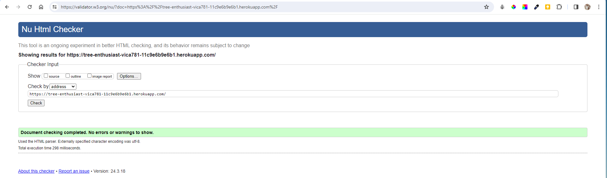

- Login Page
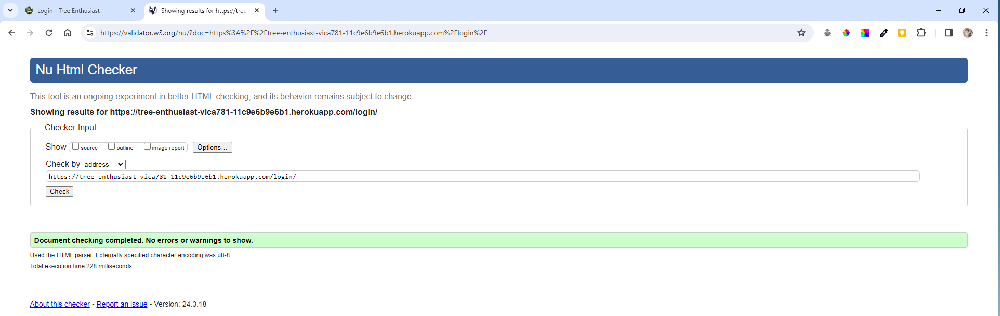

- Register Page
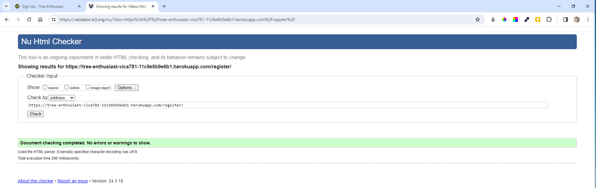

- Contact Page
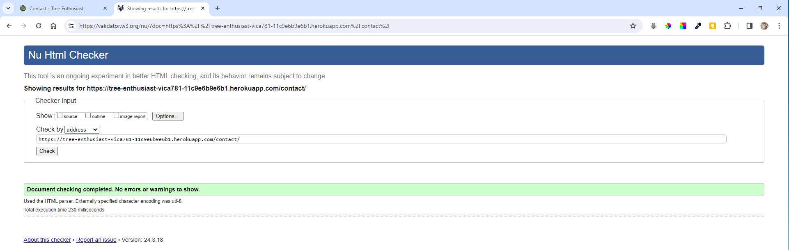

- Tree Details Page
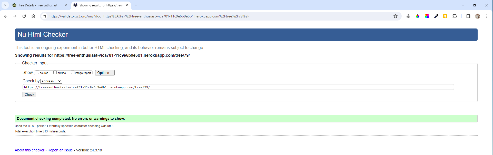

- Browse Trees Page
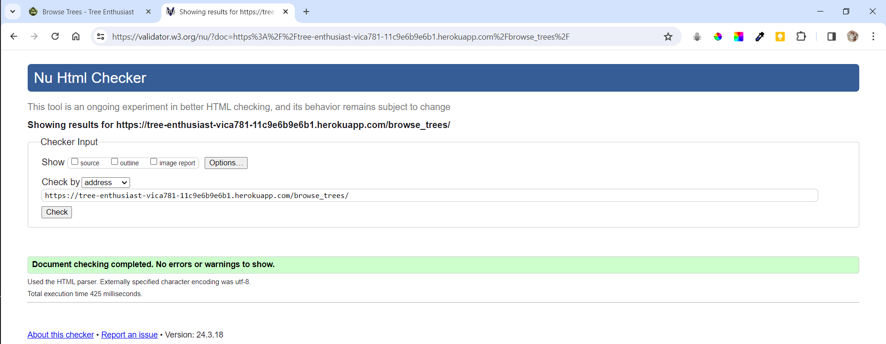

- Search Results Page
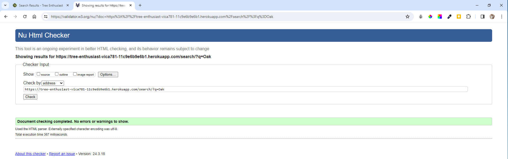

[Back to top ⇧](#table-of-contents)

#### CSS Validation
The [CSS Validation Service](https://jigsaw.w3.org/css-validator/) was used for `CSS` code.

These are the results of the validation:

- Homepage CSS File
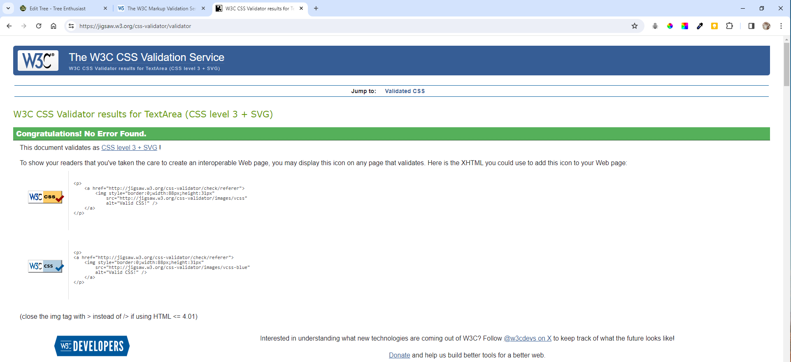

- base_generic CSS File

[Back to top ⇧](#table-of-contents)

The [JSHint JavaScript Code Quality Tool](https://jshint.com/) was used to validate the sites `JS` code.

- Script JS File
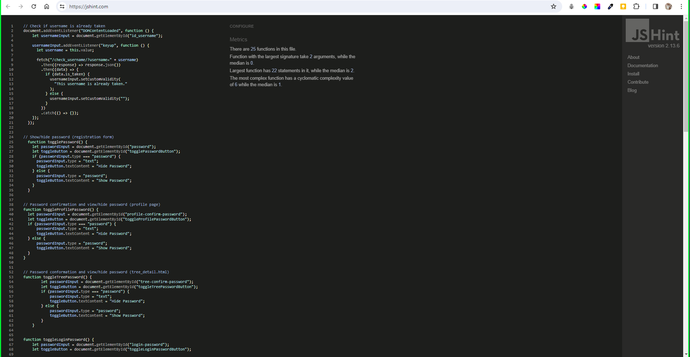

#### Python Validation
For Python code, the [CI PEP8 online validator](https://pep8ci.herokuapp.com/) was used to validate the code.

Because there are so many, the developer includes here only the results of the validation of the several files. All other Python files were validated and passed the test with same results.

- Settings.py File
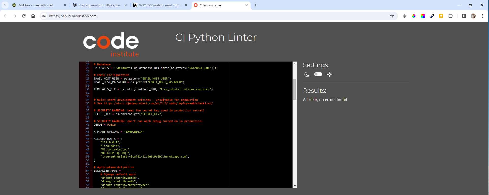

- Models.py File

- Views.py File
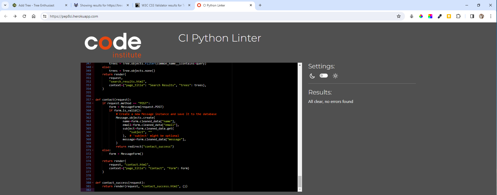

- Forms.py File

- Apps.py File
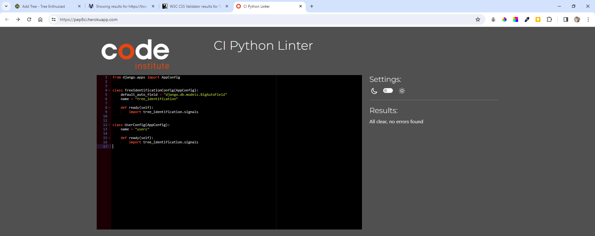

- Admin.py File
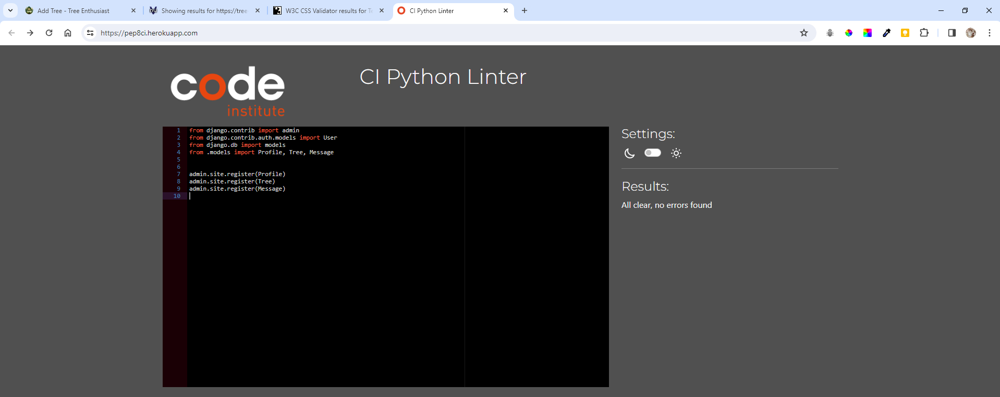

- Urls.py File
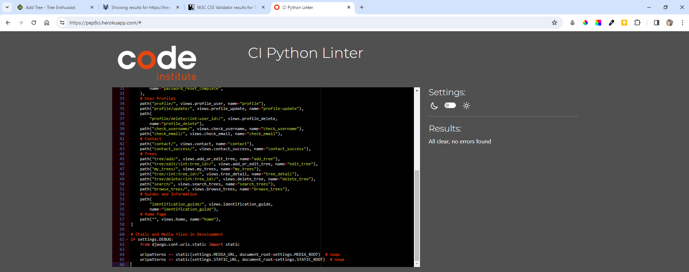

[Back to top ⇧](#table-of-contents)

### Lighthouse Validation
The [Lighthouse](https://developers.google.com/web/tools/lighthouse) tool was used to measure the performance of the website.

These are the results of the validation:

- Home Page
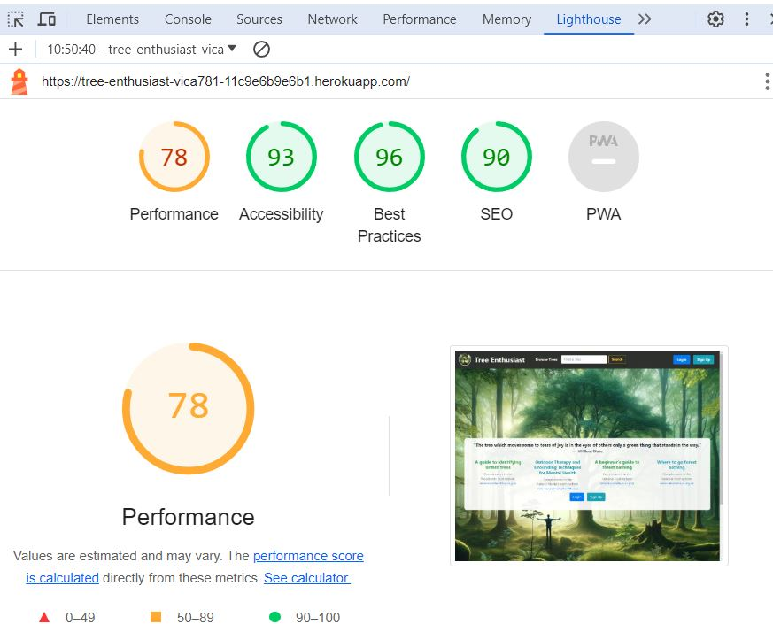

- Login Page
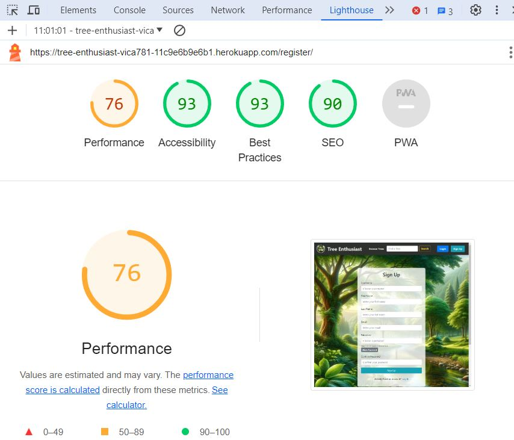

- Contact Page
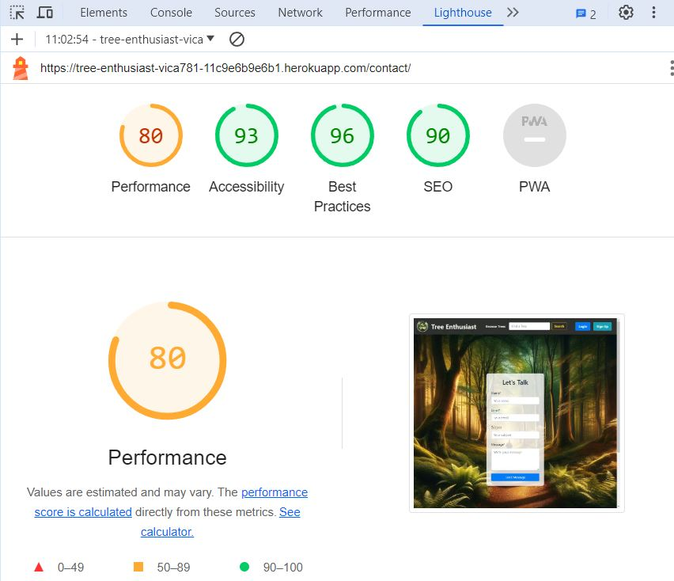

- Tree Details Page
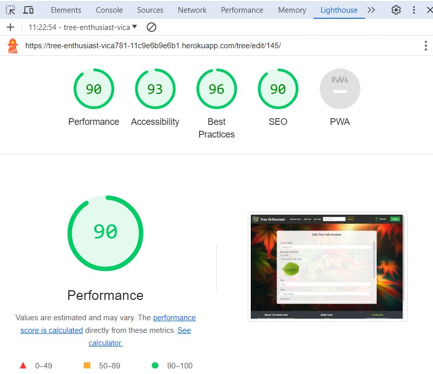

- Edit Tree Page

- Update Profile Page
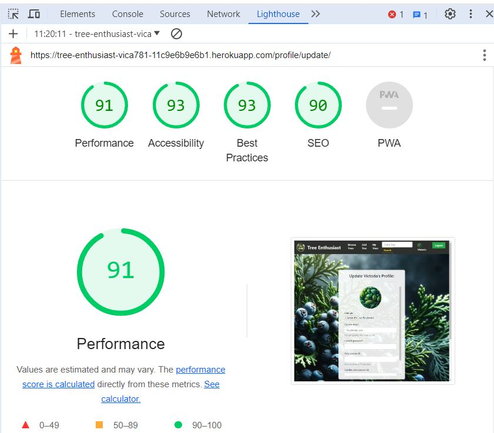

- Search Results Page
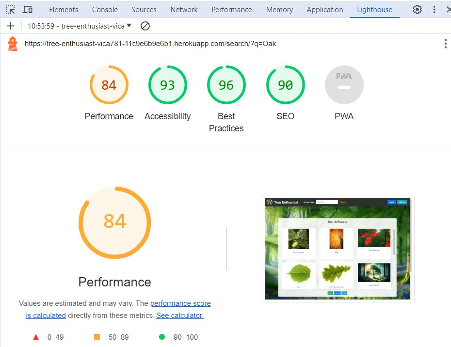

- Profile Page
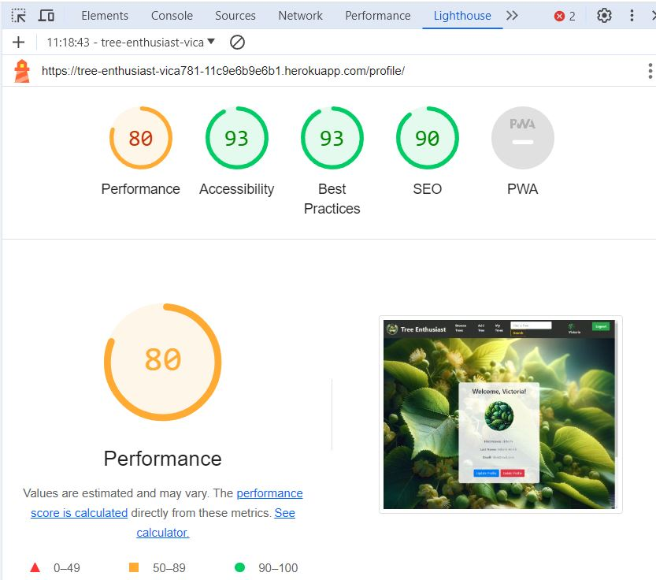

[Back to top ⇧](#table-of-contents)

### Browser Validation
The website was tested with **pass** on the following browsers:
Google Chrome, Microsoft Edge, Mozilla Firefox, Opera, Safari, Vivaldi, Brave.

In regards to **responsiveness**, the website was tested with **pass** on the following devices:
The website was tested with **pass** on the following devices:
- Laptop ThinkPad x270 on Linux Manjaro 3.0 Uranos
- Ipad Air 2 on iOS 16.7
- Iphone 12 on iOS 16.7
- Xiaomi Mi Note 11 Pro on Android 14.0.1

### User Testing
The website was tested by differen users, with different devices and browsers. The feedback was positive and the website was easy to use and navigate.
There were several suggestions for improvement, which were implemented in the future. The bugs discovered were fixed.

[Back to top ⇧](#table-of-contents)

